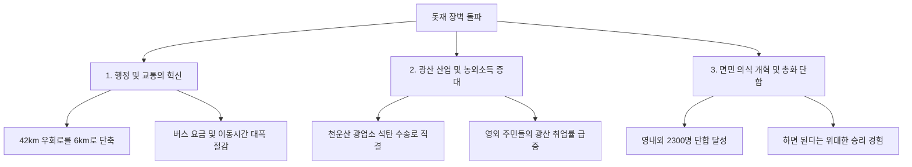

# 전남 화순군 한천면 돗재도로 개설 성공기 — 천운산 350고지의 장벽을 뚫다

---

## 1. 마을 개황 및 지리적 취약성

### 가. 천운산 장벽과 행정·생활권의 분열
전라남도 화순군 한천면은 면의 정중앙을 가로지르는 **천운산 350고지의 험준한 '돗재 고개'** 때문에 지리적·생활적으로 완전히 양분되어 있었습니다.

* **영내(營內) 지역**: 면사무소가 위치한 중심지로, 6개리 12개 자연부락(1,124가구, 5,614명)이 분포함.
* **영외(營外) 지역**: 고개 너머 외곽지로, 5개리 8개 자연부락(412가구, 2,350명)이 분포함.
* **지리적 불균형**: 면적비는 영내와 영외가 **51 : 49**로 비슷했으나, 인구비는 **70 : 30**으로 영내에 편중되어 있었습니다.

이러한 특수성으로 인해 영외 주민들은 행정구역상 한천면에 속하면서도, 가파른 돗재 장벽에 막혀 실질적인 생활권과 소비 활동은 인근 남면(南面)에 의존하고 있었습니다. 이는 면민들의 단합을 가로막고, 행정 지도를 취약하게 만드는 한천면 최고의 걸림돌이었습니다.

### 나. 기초 인구 통계 및 교육 수준 (새마을운동 이전)
* **교육 수준**: 무학 330명, 초등 졸 3,600명, 중등 재학/졸 455명, 고등 재학/졸 265명, 대학 재학/졸 37명
* **주요 성씨 분포**: 김해 김씨, 능성 구씨, 함양 박씨, 하동 정씨, 제주 양씨 등이 집성촌을 이루며 상호 조화를 이룸.

### 다. 낙후되었던 의식주 및 주거 환경
새마을운동 이전의 한천면은 주거 환경과 도로망이 극도로 낙후되어 있었습니다.
* **초가집과 흙집**: 주택의 90% 이상이 작대기만 한 부실한 기둥에 썩은 수수새 지붕을 얹은 초가집이었습니다. 광산촌 주민들은 기둥조차 제대로 세우지 않은 조악한 떼집(움막)에서 가련하게 거주했습니다.
* **불편한 울타리와 안길**: 마을 안길은 좁은 도랑(세천)을 따라 구불구불 이어져 리어카조차 다닐 수 없었습니다. 볏짚이나 수수대로 둘러친 울타리는 비가 내리면 썩은 물이 흘러내려 지나가는 주민들의 옷깃을 검게 물들이기 일쑤였습니다.
* **도로망 부재**: 마을 진입로는 물론 제대로 된 농로가 전무했습니다. 영내 주민들은 버스를 타기 위해 능주면까지 무려 8km(20리)를 걸어가야 했고, 영외 주민들은 남면까지 10km를 걸어가야 했습니다. 5일장이 열리는 날이면 온 주민들이 무거운 시장 짐을 등에 짊어지고 험한 고갯길을 위태롭게 넘나들었습니다.
* **소득 수준**: 가구당 농지는 평균 0.6ha에 불과했으며, 고지대 냉해로 인해 평당 수확량이 매우 낮았습니다. 2모작은 봄감자 경작이 전부였고, 한우 증식이나 화전을 이용한 고추·연초 재배, 산에서 숯을 굽거나 땔나무를 해다 파는 영세한 수입에 의존했습니다. 주민들의 가구당 연평균 소득은 겨우 **250,000원**에 불과해 가난과 무지 속에서 하루하루 연명하는 형편이었습니다.

---

## 2. 돗재도로 개설의 추진 동기와 전개 과정

### 가. 실패를 딛고 피워낸 희망의 불씨
* **1971년 시험 사업**: 최초에 정부 지원으로 시행한 소규모 새마을 공동 사업들은 기술 부족과 주민들의 비협조로 부실 공사로 끝나며 좌절을 맛보았습니다. 하지만 주민들의 마음속에는 "우리도 힘을 합하면 무언가 해낼 수 있다"는 작지만 소중한 자신감이 싹트기 시작했습니다.
* **1973년 최초의 도전**: 1973년 1월 13일, 통일주체국민회의 대의원이었던 **조규선** 씨의 제의와 **구재우** 면장의 주관으로 '돗재도로 개설 추진위원회'가 구성되었습니다. 주민 1,021명의 서명을 받아 중앙정부와 지방 당국에 진정서 및 건의서를 제출했으나, 막대한 공사비와 기술적 난제에 부딪혀 여의치 못하고 좌절되었습니다.
* **1975년 새마을 협동권 사업 선정**: 오랜 장벽인 돗재를 뚫지 않고는 가구당 소득 140만 원 달성이 불가능하다고 판단한 **금중진** 신임 면장은 돗재도로 개설을 '새마을 협동권 공동 사업'으로 제안했습니다. 이를 화순군(군수 문병우)에서 전격 채택하자 면민들은 기쁨에 겨워 환호했습니다.

### 나. 횃불을 밝힌 면민들의 총궐기 (1976년)
* **1976년 2월 18일 면민 대회**: 전 면민이 한천국민학교 강당에 모여 결의대회를 개최했습니다. 문병우 화순군수는 "하면 된다"는 박정희 대통령의 굳센 신념을 강조하며, *"우선 사람과 우마차가 다닐 수 있는 폭 2m의 길부터 우리 힘으로 뚫어보자"*고 제안했습니다. 주민들은 우레와 같은 함성으로 이에 동참을 굳게 다짐했습니다.
* **1976년 5월 14일 착공**: 측량에만 3개월이 소요되었습니다. 면내 청년과 예비군 520여 명을 포함한 **연인원 6,500명**이 톱과 괭이를 들고 산으로 들어가 벌채 작업을 시작했습니다. 험준한 암석 지대를 제외하고 폭 2m, 길이 2.5km의 기초 도로를 주민들의 손으로 직접 개척해 나갔습니다.
* **1977년 1월 IBRD 차관 사업 선정**: 주민들의 눈물겨운 투쟁과 도로 개설의 타당성을 인정한 정부는 이를 **IBRD 차관 농로개설 사업**으로 전격 반영하여, 마침내 정식 도로로 확포장할 수 있는 제도적·재정적 기반을 마련해 주었습니다.

---

## 3. 삼복더위와 천재지변을 이겨낸 애로 극복 상황

### 가. 37도 불볕더위 속 앞당긴 준공 목표
당초 완공 목표는 1977년 10월 말이었으나, 주민 교통 편의를 위해 완공을 2개월 앞당기기로 결정했습니다. 삼복염천(三伏炎天)의 37도가 넘는 가마솥더위 속에서 주민들은 입술을 깨물며 작업을 강행했습니다.

### 나. 말라 죽은 잔디와 177mm 폭우의 대재앙
* **90% 잔디 고사**: 절개지 붕괴를 막기 위해 무려 230리(약 90km) 밖에서 덤프트럭으로 잔디를 실어 왔습니다. 높은 곳은 무려 15m에 달하는 절벽에 사다리를 타고 올라가 대꼬챙이로 고정하며 18,200m² 규모의 떼붙임 공사를 마쳤습니다. 그러나 7~8월에 극심한 한해(가뭄)가 덮치면서 정성껏 입혀놓은 잔디의 90% 이상이 누렇게 말라 죽고 말았습니다. 주민들은 타들어 가는 잔디를 보며 무심한 하늘을 원망하며 눈물을 흘렸습니다.
* **177mm 폭우와 사면 붕괴**: 마침내 애타게 기다리던 비가 내렸으나, 이는 순식간에 **177mm의 집중 폭우**로 돌변하여 절벽을 강타했습니다. 피땀 흘려 쌓아 올린 언덕과 잔디 복구 구역 10,000m²가 순식간에 무너지며 토사가 온 길을 덮쳤습니다. 주민들은 가슴이 찢어지는 듯한 절망감에 휩싸여 주저앉았고, 농작물 병충해까지 겹쳐 공사장은 깊은 실의에 빠졌습니다.

### 다. 산봉우리 천막 투쟁과 밤샘 야간 작업
* **지도자들의 솔선수범**: 주민들의 사기가 바닥으로 떨어지자, **문학구** 추진위원장은 즉석 연설을 통해 주민들의 얼어붙은 마음에 다시금 불을 지폈습니다. 금중진 면장과 문학구 위원장은 산봉우리 험한 나무 밑에 천막을 치고 밤새 이슬을 맞아가며 현장을 지켰습니다.
* **횃불 야간 작업**: 뜨거운 한낮의 불볕더위를 피해 새벽과 야간 시간을 활용하기로 했습니다. 이른 새벽부터 밤늦게까지 수백 개의 **횃불**을 밝혀 들고 야간 돌깨기 및 흙 나르기 공사를 이어갔습니다. 이 웅장한 횃불 행렬은 어두운 천운산 중턱을 붉게 수놓으며 기적의 서막을 알렸습니다.

---

## 4. 각계각층의 눈물겨운 기부와 미담 가화

### 🤝 [미담 1] 육군 기술중기부대(CAC 사령부)의 대민 지원
천운산 350고지의 험난한 암석 절개 작업 중 주민들의 힘만으로는 도저히 부술 수 없는 거대한 암벽 장벽에 부딪혔습니다. 이 소식을 들은 인근 군부대(CAC 사령부)에서는 페이로더, 에어 콤프레셔, 불도저 등 중장비 3대와 전문 요원들을 투입하여 **22일간 밤낮으로 암벽 발파 및 정지 작업**을 무상 지원해 주었습니다. 군과 민이 하나 된 총화 안보의 위대한 본보기였습니다.

### 🤝 [미담 2] 도급업자 권태영 사장의 감동적인 거액 희사
토공 도급을 맡았던 **(주)권태영 사장**은 애초 예산이 턱없이 부족하여 도중에 손실을 입을 위기에 처했습니다. 그러나 36도가 넘는 뙤약볕 아래서 온몸이 흙투성이가 된 채 횃불을 들고 일하는 주민들의 눈물겨운 단결력에 큰 감동을 받았습니다. 권 사장은 *"주민들의 가난을 조금이라도 덜어주고 이 위대한 역사에 동참하겠다"*며 자신의 공사 대금 중 무려 **25,000,000원**을 조건 없이 마을에 기부(희사)하여 공사를 완벽하게 마무리 지어주었습니다. 면민들은 고마움의 뜻을 담아 그의 이름을 새긴 감사패를 증정했습니다.

### 📊 [토지 및 현물 희사 명단 (일부)]

| 기부 연월일 | 기부자 성명 | 기부 내역 | 시가 환산액 (원) | 비 고 |
| :---: | :--- | :--- | :---: | :--- |
| **1977. 07. 20** | **문학구** | 전(밭) 90평 | 70,000 | 추진위원장 솔선수범 |
| **1977. 07. 20** | **이상호** | 대지 100평 | 100,000 | 문전옥답 희사 |
| **1977. 07. 20** | **박재출** | 전(밭) 50평 | 50,000 | 도로 편입용지 |
| **1977. 07. 20** | **화순군** | 군유 임야 11,350평 | 113,500 | 행정 지원 |
| **1977. 07. 20** | **도 교육위원회** | 학원 부지 일부 | 141,000 | 학교 용지 편입 |

---

## 5. 돗재 장벽 준공의 위대한 역사적 성과

### 가. 기적의 도로 제원 및 공사 개요
* **공사 기간**: 1976년 2월 9일 ~ 1977년 9월 30일 (총 **234일간**의 사투)
* **총 투입 인원**: **연인원 45,000명**
* **총 공사비**: **164,887,245원**
  * 국고 및 지원금: 106,118,000원
  * 주민 자체 부담금: 58,769,245원
* **개설 도로 제원**: **해발 350m 준령 돌파, 도로 총연장 6.0km, 도로 폭 6.0m 전천후 도로 완공**

### 나. 돗재 도로 개설의 3대 혁신 효과

#### 1) 행정 및 생활 교통의 혁신
영외 5개리 8개 자연부락의 2,300여 주민들이 등본 한 장을 떼기 위해 해발 350m의 천운산을 지게를 지고 넘거나, 버스를 3번이나 갈아타며 무려 **42km(100리) 길을 우회하던 악순환이 완전히 종식**되었습니다. 이동 거리 가 6km로 단축되어 버스비와 시간이 획기적으로 절약되었습니다.

#### 2) 광산 활성화 및 고용 소득 증대
천운산 중턱에 있는 무연탄 광업소의 석탄 수송이 원활해졌으며, 영외 주민들이 돗재 도로를 통해 손쉽게 탄광에 취업할 수 있는 길이 열렸습니다. 험난한 고갯길이 번듯한 **'산업 경제 도로'**로 직결되면서 탄광 노임 소득과 축산, 밤·감·대추 같은 유실수 조성으로 농가 소득이 급증하게 되었습니다.

#### 3) 주민 의식의 대전환
백 년 동안 굳게 닫혀 있던 돗재의 빗장을 면민들의 손으로 직접 부수어 열면서, 분열되었던 주민 여론이 하나로 통일되었습니다. *"뜻이 있는 곳에 반드시 길이 있다"*는 평범하지만 위대한 진리를 온몸으로 체험하며, 자손만대에 물려줄 영광스러운 복지 농촌 유산을 스스로 일구어냈다는 위대한 자부심을 갖게 되었습니다.

---

## 6. 천운산 고개 마루에 새겨진 「새마을의 의지」

주민들은 눈물과 땀으로 완성된 돗재 고개 마루 정상에 웅장한 기념비를 세우고 온 면민의 뜨거운 의지를 비석에 새겨 넣었습니다.

> ### 🪦 돗재 도로 개설 기념비문 「새마을의 의지」
> 
> "험준한 돗재 장벽 때문에 평생토록 한많은 설움과 말할 수 없는 불편을 겪어야 했던 우리 한천면민은 이 막힌 도로를 스스로 뚫기 위해 근면·자조·협동의 위대한 새마을 정신으로 굳게 뭉쳤습니다. 
> 
> 이른 새벽부터 칠흑 같은 밤늦게까지 횃불을 밝혀 들고 힘을 모아 피땀 흘려 일했습니다. 이에 감동하신 박정희 대통령 각하께서 특별 하사금을 내려 주셨고, 고건 전남도지사님께서는 직접 이 험한 현지 골짜기를 찾아 저희들의 손을 잡고 격려해 주셨습니다.
> 
> 우리 한천면민 일동은 우리를 도와주신 모든 분들께 진심으로 머리 숙여 감사를 드리며, 온 면민이 새마을의 푸른 의지로 한 땀 한 땀 쌓아 올린 이 영광의 금자탑을 자손만대에 전하기 위해 여기에 뜨거운 뜻을 새겨 기념비를 세웁니다."
> 
> **1977년 9월 30일 — 한천면민 일동**

---
*(출처: 영광의 발자취 - 마을 단위 새마을운동 추진사 제1집)*
