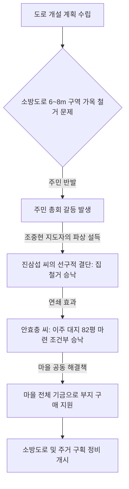

# 경기도 부천시 소사동 탁박골마을 — 무허가 달동네에서 청정 선진 복지마을로, 원미산 자락의 눈부신 이주민 기적

---

## 1. 마을 개황 및 혹독한 빈곤의 시절

### 가. 원미산 자락의 버려진 국유지, 달동네의 형성
경기도 부천시 소사동 탁박골마을은 부천시청 동북쪽 약 3km 지점, **개발제한구역(그린벨트)으로 묶인 원미산 중턱** 험하고 가파른 고지대에 자리 잡고 있었습니다. 

* **이주민들의 정착**: 1965년 이전까지 이곳은 우거진 잡목과 돌투성이의 버려진 국유 임야였습니다. 1965년 봄, 침상등·윤길중·신영분 등 세 세대가 가난을 피해 산비탈에 흙벽을 바르고 가마니를 얹은 무허가 토담집을 지으며 마을의 역사가 시작되었습니다.
* **영세 이주민 노동자촌**: 이후 도심의 철거민들과 일자리를 찾아 모여든 영세 취로 노동자들이 비탈길을 따라 다닥다닥 토담집을 지으면서, 1969년에는 37세대 규모의 무허가 달동네를 형성하게 되었습니다. 

### 나. 패배주의와 무기력한 의식구조
주민 대부분이 인근 공사장의 일용직 품팔이로 하루 벌어 하루 먹고사는 극빈층이었습니다. 오랜 가난과 뜨내기 삶에 시달려온 이들의 의식 속에는 *"어차피 내 땅, 내 집도 아닌데 정성 들여 가꿀 필요가 없다"*는 자조적인 패배주의가 뿌리 깊게 박혀 있었습니다. 내일의 희망이나 이웃을 위한 희생정신은 찾아볼 수 없었고, 서로를 불신하며 하루하루 연명하기에 급급한 삭막한 마을이었습니다.

---

## 2. 조중현 지도자의 헌신과 희망의 전기 (1969~1975)

### 가. 어둠을 밝힌 횃불, 마을 전기 사업 (1969년)
탁박골마을에 기적의 서막을 연 인물은 **조중현** 지도자였습니다. 그는 1967년 산비탈에서 닭을 기르는 양계업을 하기 위해 이곳에 정착했습니다. 

* **전화(電化) 사업 추진**: 1969년 국민반장으로 선출된 그는 주민들의 삶을 바꾸기 위해 전깃불 가설이 급선무라고 믿었습니다. 신덕균·한빈·신량수 등 뜻을 같이하는 주민들과 '전화 사업 추진위원회'를 구성하고 정부의 문을 두드렸습니다.
* **사재 18만 원 쾌척**: 정부 지원금은 단 11만 4,000원에 불과했고, 극빈층 주민들에게 공사비를 거두는 것은 불가능해 보였습니다. 이에 조중현 지도자는 자신의 양계 수익 중 절반에 달하는 **사재 18만 원을 선뜻 기부**하여, 착공 2개월 만인 1970년 2월 온 마을에 호롱불 대신 밝은 전기 불빛을 선물했습니다. 지원금의 10배가 넘는 가치를 창출한 이 사건으로 주민들은 서서히 마음의 문을 열기 시작했습니다.

### 나. 부천시 승격과 독립 행정 통 편성 (1975년)
1973년 7월 부천시 승격에 따라 소사동 6통으로 개편되었고, 1975년 6월 통·반 개편에 따라 **소사동 13통**으로 마침내 독립된 단일 행정구역의 지위를 얻게 되었습니다. 조중현 지도자는 주민들의 만장일치 추대로 초대 통장 겸 새마을지도자로 취임하여 대대적인 마을 개조 사업을 준비해 나갔습니다.

---

## 3. 선진마을 개발과 가옥 철거의 갈등 극복 (1976~1977)

### 가. 1977년 도 특수시책 '선진마을 개발사업' 선정
1976년 7월, 우수 마을 특별지원 사업비 50만 원을 지원받아 골목길을 정비한 탁박골마을은 마침내 **1977년 경기도 특수시책인 '선진마을 개발사업'** 대상지로 전격 선정되었습니다. 시비 240만 원의 막대한 자금 배정이 예고되면서, 마을 전체를 바둑판처럼 반듯하게 구획 정리하는 대수술이 예고되었습니다.

### 나. "내 집은 못 헌다" — 도로 개설과 가옥 철거 대치
마을을 살리기 위해서는 차가 다닐 수 있는 폭 6~8m의 소방도로 신설이 필수적이었습니다. 그러나 도로가 가로지르는 중심부의 가옥과 시설물들이 무자비하게 헐려야만 하는 절체절명의 난관에 부딪혔습니다.

* **철거 대상**: 김두석 씨 토지 편입, 성오순 씨 가옥 철거, 박영진 씨 양계장 및 가옥 철거, 진삼섭 씨 가옥 철거, 원득선 씨 부속 건물 철거 등.
* **거센 반발**: 빈민들의 유일한 안식처인 집을 헐어야 한다는 소식에 당사자들은 격노하여 반대했습니다. 주민회의는 고성과 비아냥으로 아수라장이 되었고 *"개인 재산에 막대한 피해를 주면서까지 사업을 하는 것은 당치 않다"*라며 거세게 대치했습니다.

### 다. 개별 설득과 감동의 합의 도출
조중현 지도자는 물러서지 않고, 반대하는 가구의 가장들을 밤낮으로 찾아가 무릎을 꿇고 간곡하게 설득했습니다. 

1. **진삼섭 씨의 위대한 결단**: 가장 큰 부지를 차지하고 있어 핵심 키를 쥐고 있던 **진삼섭** 씨를 조 지도자가 열 번이 넘는 개별 방문 끝에 승낙을 받아냈습니다. 진삼섭 씨는 *"지도자의 헌신을 보고 깨달은 바가 크다. 도로가 뚫리면 결과적으로 내 땅값도 오르고 마을의 발전도 10년은 앞당겨질 것이다"*라며 기꺼이 집을 철거하는 데 선두에 서 주민들에게 큰 감동을 주었습니다.
2. **안효충 씨의 이주 부지 마련**: 집을 헐고 싶어도 옮겨 지을 여력이 없던 **안효충** 씨를 위해, 조 지도자는 마을의 빈 땅 82평을 온 주민의 협조와 마을 공동 기금의 주선으로 저렴하게 살 수 있도록 책임지고 중재해 주어 철거 합의를 도출해 냈습니다.

---

## 4. 공동 소득 창출과 복지 주거 환경의 완성

### 가. 아낙네들의 위대한 땀방울, 부녀회 공동 무·배추 사업
소사동 13통 부녀회는 기금을 마련하기 위해 버려진 야산 비탈길을 일구어 공동 경작지를 만들었습니다.
* **눈물겨운 리어카 수송**: 무와 배추를 심고 밤낮으로 정성껏 가꾼 끝에, 5월 수확기가 되자 부녀회원들이 직접 무거운 리어카에 채소를 싣고 4km나 떨어진 부천 시내 공장지대와 전통시장을 돌며 매일 장사를 했습니다.
* **경이로운 소득**: 생산비 40만 원을 제외하고 무려 **90만 원의 순수익**을 거두어 전액 부녀회 공동 기금으로 적립, 마을 보수와 가난한 집안의 이주 지원금으로 사용하며 마을 자립의 튼튼한 젖줄을 마련했습니다.

### 나. 주거 환경의 천지개벽
* **수도 통수식의 감격**: 식수난으로 고통받던 탁박골마을에 드디어 간이 급수시설이 준공되었습니다. 부천시장과 각계 내빈 90여 명이 참석한 통수식에서, 수도꼭지를 틀자 시원한 수돗물이 힘차게 뿜어져 나왔고, 주민들은 서로 껴안고 눈물을 흘리며 함성을 질렀습니다.
* **주택 개량 및 주거 구획 정리**: 꼬불꼬불한 달동네 길을 없애고 6~8m의 바둑판식 안길을 신설하여 자갈을 깔았습니다. 낡은 판잣집들을 말끔히 철거하고 규격화된 주택으로 개축·도색하였으며, 담장 1,000m를 정비하고, 변소와 굴뚝을 개량해 위생 수준을 획기적으로 격상시켰습니다.

---

## 5. 향후 발전 계획 (1978~1980)

탁박골마을은 1단계 선진 복지 환경 조성을 완료한 데 만족하지 않고, 서울과 부천을 연결하는 중심 거점으로 도약하기 위한 중장기 계획을 수립했습니다.

1. **서울~부천 연결 도로 포장**: 마을 앞을 통과하는 서울 연계 도로 1,000m 구간을 총 공사비 3,000만 원을 투입해 완전 포장, 서울~부천 간의 광역 교통로 일부가 탁박골마을을 경유하도록 유도할 예정입니다.
2. **마을 안길 완전 포장**: 신설된 2,000m의 안길을 완전히 시멘트로 포장하여 차량 통행을 원활히 하고, 주민 소득 원천을 개발하여 수도권 최고의 선진 시범 마을로의 굳건한 입지를 굳힐 계획입니다.

---
*(출처: 영광의 발자취 - 마을 단위 새마을운동 추진사 제1집)*
