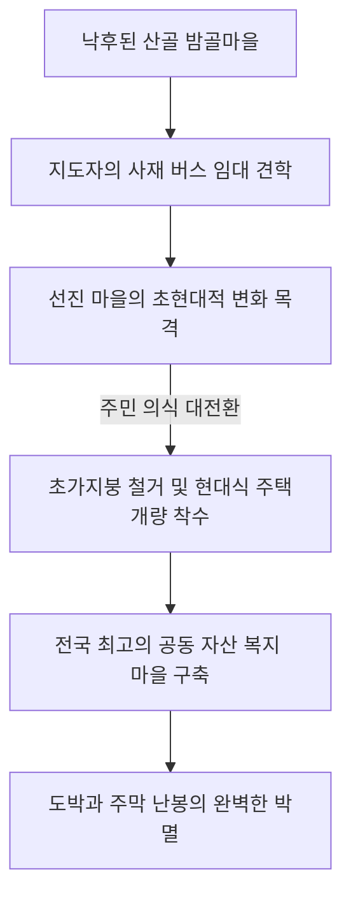

# 경기 안성군 일죽면 금산리 율동마을 — 15년 군 생활 끝에 고향을 구원한 예비역 지도자의 솔선수범, 난봉과 도박의 소굴에서 모범 복지촌으로

---

## 1. 마을 개황 및 새마을운동 이전의 무질서한 과거

### 가. 사방이 산으로 둘러싸인 충북 도계의 외딴 산골
경기도 안성군 일죽면 금산리 율동마을(밤골마을)은 안성군청 동남쪽 끝자락, 충청북도와 인접하여 도계를 이루고 있는 험준한 산간 오지였습니다. 약 570년 전 원주 원씨 가문에 의해 형성된 유서 깊은 집성촌이었으나, 산간 지대의 지리적 한계로 인해 벼농사보다는 척박한 밭농사(전작) 비율이 훨씬 높았습니다. 주민들은 고추와 담배(엽연초) 재배에 매달려 연명하는 가난한 영세 소작농들이 대부분이었습니다. 총 65호(농가 61호, 비농가 4호)의 주민 358명이 살고 있었습니다.

### 나. 나태와 도박, 그리고 무례했던 동네 풍습
새마을운동 이전의 율동마을은 지독한 가난보다 주민들의 피폐해진 정신과 도덕적 해이가 더 큰 문제였습니다.
* **주막 난봉과 무례한 풍습**: 나태함이 뼈에 사무친 주민들은 궂은일은 피한 채 남을 헐뜯고 질투하기에 바빴습니다. 어른들에게 불손하기 짝이 없었으며, 이웃집에 손님이 찾아오면 대뜸 주막으로 끌고 나가 강제로 술을 빼앗아 먹는 고약한 패악질이 일상적으로 반복되었습니다.
* **담배 수납금과 도박 판돈**: 가을철 피땀 흘려 담배를 수납하여 받은 소중한 수확 자금은 밤낮없이 도박판의 판돈으로 탕진하기 일쑤였습니다. 겨울 내내 일은 하지 않고 술타령으로 시간을 보내다 봄이 되면 양식이 떨어져 이웃 마을에서 높은 이자의 장리빚을 얻어다 연명하고, 가을에 수확한 농산물을 빚 갚는 데 다 써버리는 빈곤의 악순환이 대를 이어 지속되었습니다. 
* **방치된 시멘트**: 정부에서 무상 지원한 시멘트 335포대마저도 주민들의 무관심과 지도자의 통솔력 부족으로 방치되었습니다. 주민들은 시멘트를 내 집 부엌 바닥이나 마당에 대충 바르는 등 사적인 용도로 낭비해 버리기 일쑤였습니다.

---

## 2. 15년 군 생활을 마친 군인 출신 지도자의 고향 귀환 (1972년)

### 가. "이대로는 고향이 망한다" — 예비역 상사의 구국적 결단
* **고향 귀환 (1972년 2월)**: 15년간의 혹독한 군 생활을 마치고 서울의 번듯한 직장에 다니던 예비역 상사 출신의 **새마을지도자**는 문득 도시의 삶이 인생의 전부가 아님을 깨달았습니다. 그는 직장을 과감히 그만두고 고향 율동마을로 내려왔습니다. 그러나 고향의 풍경은 나태와 무질서, 도박과 난봉으로 얼룩져 있었습니다. 깊은 실망감 속에서도 그는 고향을 살리는 것이 조국을 지키는 일과 다름없다고 믿고 율동마을을 표준 농촌 마을로 육성하겠다는 위대한 결심을 굳혔습니다.
* **좌절을 이겨낸 총회 소집 (1972년 3월)**: 3월 19일 뜻을 함께하는 청년 동지 4명과 밤샘 토론 끝에 3월 21일 마을 총회를 소집했습니다. 그러나 정작 총회에 참석한 주민은 단 15명뿐이었습니다. 그는 실망하지 않고 영농 좌담회로 회의를 마친 뒤, 5일간 가구마다 찾아가 머리를 숙인 끝에 3월 26일, 무려 49명의 주민이 참석한 가운데 압도적인 찬성으로 새마을지도자에 선출되었습니다.

### 나. "골빈 놈, 미친놈" — 비아냥을 이겨낸 솔선수범
* **몸소 실천하는 계도**: 지도자는 아침 일찍 가장 먼저 빗자루를 들고 마을 안길을 쓸었고, 남들이 꺼리는 궂은 오물 수거와 하수구 정비에 앞장섰습니다. 일부 주민들은 그런 그를 향해 *"서울서 헛바람이 들더니 군대 생활 오래 하다가 드디어 미쳤다", "골빈 놈"*이라며 노골적으로 비웃고 화투판으로 향했습니다.
* **반대파의 자발적 승복**: 지도자는 아무런 대꾸 없이 묵묵히 주민들의 집안 가사나 궂은 농사일을 제 일처럼 도왔습니다. 비가 내리면 남의 집 가마니를 덮어주고 지붕을 고쳐주는 지도자의 눈물겨운 솔선수범에 비아냥거리던 반대파 주민들조차 마침내 감동하여 스스로 삽을 들고 뒤를 따르게 되었습니다.

---

## 3. 문명 개화와 주민 시야를 넓힌 우수 시범 마을 견학

### 가. 2개월 만의 호롱불 퇴출, 전기가설 대업 (1973년)
지도자는 주민들의 사기가 오르자 가장 먼저 문명 혜택인 전기 사업에 착수했습니다. 주민들의 적극적인 협동으로 착공 **단 2개월 만에** 호롱불을 완전히 몰아내고 대낮처럼 밝은 전깃불을 온 동네에 가설하여 낙후된 산골 오지라는 인식을 완전히 지워버렸습니다.

### 나. 외지 재벌 독지가의 마음을 움직인 앰프 기증
마을의 단결과 정신 교육을 위해서는 방송 시설이 필수적이었습니다. 지도자는 마을 출신으로 타지에서 성공한 자산가를 직접 찾아가 고향의 변화를 호소했습니다. 그의 헌신에 감동한 자산가는 시가 54,000원에 달하는 고성능 방송 앰프 1대를 선뜻 기부해 주었습니다. 지도자는 매일 새벽과 저녁으로 전 주민에게 건전가요와 최신 영농 기술 정보를 방송하며 공동체 의식을 고취시켰습니다.

### 다. 사재로 버스를 전세 낸 '우수 시범 마을 견학' (1974년)
1974년 2월 10일, 지도자는 형식적인 무기력한 임원진을 박력 있고 참신한 인물들로 전면 교체했습니다. 그리고 이틀 뒤인 2월 12일, 주민들의 좁은 안목을 깨뜨리기 위해 **자신의 사재를 털어 전세버스 1대를 임대**했습니다. 마을 개발위원들과 청년, 부녀회 핵심 임원들을 태우고 전국 최고 수준의 새마을 시범 마을들을 일일이 견학시켰습니다. 

다른 동네의 천지개벽한 발전상을 직접 눈으로 본 주민들은 가슴이 뜨거워져 돌아오는 버스 안에서 눈물을 흘리며 *"우리도 당장 초가집 지붕을 뜯어내자"*며 다짐했습니다. 그 결과 대대적인 주택 개량과 지붕 정비 사업이 일사천리로 완수되었습니다.

---

## 4. 전국 최고 수준의 마을 공동 자산 확보 성과

율동마을 주민들은 단합된 협동력과 부녀회의 절미 저축, 공동 경작 활동을 통해 웬만한 읍 단위 부촌 부럽지 않은 방대한 마을 공동 자산을 완벽하게 확보했습니다.

### 🏢 율동마을 공동 자산 및 복지 시설 현황

| 공동 시설 및 자산 항목 | 규모 및 제원 | 실질적 활용 목적 |
| :--- | :---: | :--- |
| **마을 공동 기금 농토** | **1,000 평** | 경작 수익 전액을 마을 장학금 및 복지비로 적립 |
| **새마을 복지 회관** | **30 평** | 주민 총회, 예식장, 영화 상영, 영농 교육장 |
| **마을 공동 보관창고** | **65 평** | 정부 비료, 조달 농자재 및 수확 공동 비축 |
| **마을 공동 구판장** | **10 평** | 생필품 최저가 공동 구매 및 부녀회 운영 |
| **마을 공동 정미소** | **25 평** | 도정 비용 절감을 통한 가구당 경제적 혜택 제공 |
| **마을 공동 목욕탕** | **4 평** | 영농 지친 피로를 해소하는 농촌 최초의 온수 목욕탕 |
| **마을 공동 작업장** | **37 평** | 농한기 가마니 짜기 및 가내 부업 소득 창출 공간 |

> [!IMPORTANT]
> 15년 군 생활의 엄격한 규율 and 무한한 솔선수범으로 나태와 도박의 소굴이었던 고향을 구해낸 새마을지도자의 뜨거운 집념은 안성군 최고 오지 율동마을을 **대한민국 최고의 공동 자산을 보유한 무결점 복지 모범촌**으로 바꾸어 놓았습니다.

---
*(출처: 영광의 발자취 - 마을 단위 새마을운동 추진사 제1집)*
