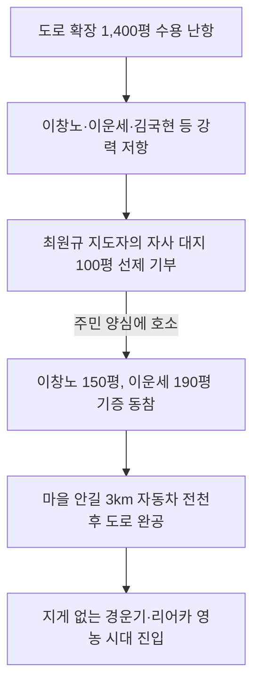

# 강원 영월군 수주면 도원1리 — 주천강의 고립된 섬마을에서 전국 우수 방영 복지촌으로, 부부 훈장 지도자의 눈물겨운 대지 희사와 영농 개혁

---

## 1. 마을 개황 및 외딴 섬과 같았던 가난의 세월

### 가. 주천강이 삼면을 둘러싸고 흐르는 외딴 분지
강원도 영월군 수주면 도원1리(복숭아골)는 주천강(酒泉江)이 삼면을 에둘러 흐르고 있어, 지리적으로 마치 강물 속에 고립된 한 조각 섬과 같은 기형적 분지 형태였습니다. 

* **기초 환경 및 소득 수준 (1970년대 이전)**: 총 74호의 가구에 주민 133명이 거주하던 작은 부락이었으나, 외부와 연결되는 통로가 전무했습니다. 70년대 초까지만 해도 가구당 연평균 소득은 불과 **300,000원** 안팎으로 관내에서 가장 가난한 벽지였습니다.
* **매년 덮친 수해와 고립**: 봄철만 되면 극심한 가뭄(조해)에 시달렸고, 삼복장마철이 오면 주천강에 제방이 쌓여 있지 않아 비옥한 농경지가 매년 유실되거나 통째로 흙더미에 묻혔습니다. 외지와 통행하는 유일한 수단은 강바닥의 위태로운 나룻배 한 척이 고작이었으며, 우기에는 배마저 다닐 수 없어 완전히 격리되었습니다. 아이들은 강 너머 4km 떨어진 면 소재지의 초등학교로 목숨을 걸고 통학해야 했고, 매년 낙동강과 주천강에서 한두 명의 어린 학생들이 도강 중 시체조차 찾지 못하는 익사 참변을 당했으나 주민들은 이를 숙명(宿命)으로 알고 살았습니다.
* **불결했던 주거 환경**: 집들은 썩어 무너져가는 초가 흙집이었고 담장이나 울타리도 없었습니다. 우물이나 펌프가 없어 강물을 그대로 길어다 먹었으며, 아낙네들은 온종일 무거운 물동이를 이고 날라야 했습니다. 방안은 벽지조차 바르지 않아 등을 대면 옷에 흙이 묻어났고, 방바닥은 거친 돗자리가 전부여서 아이들이 뛸 때마다 흙먼지가 가득 차 숨을 쉬기 힘든 참담한 위생 속에서 등잔불의 새까만 그을음과 동거하고 있었습니다.

### 나. 빈곤의 체념과 폭력적인 풍습
주민들은 빈곤을 숙명으로 여겨 매사에 나태했고 체념에 젖어 살았습니다. 
* **시장판 난봉과 화투 삼매경**: 5일마다 돌아오는 주천 시장 날이 되면, 20리 길을 걸어가 외상술을 마시고 취해 아무에게나 시비를 걸며 싸움질로 시간을 보냈습니다.
* **부녀자 누에고치 판매 대금 갈취**: 가장 한심한 일은, 봄철 부녀자들이 온 산을 헤매며 산뽕나무 잎을 따다 누에를 쳐서 어렵게 벌어온 고치 판매 대금을 도중 주막에서 남편들이 술값으로 탕진해 버리는 패악질이었습니다. 남편들은 술에 취해 집에 들어와 주정을 부리고 가재도구를 때려 부수며 가련한 부녀자들을 때리는 등 폭력이 빈번했습니다. 겨울이면 사랑방에 모여 도박판을 벌여 하룻밤 새 전 재산을 잃고 매년 한두 가구가 빚 독촉을 피해 밤도망을 가야 했던 참담한 동네였습니다.

---

## 2. 최원규·엄화자 부부 훈장 지도자의 헌신과 전기

마을을 살리기 위해 나선 두 지도자는 부부이자 동지로서 탁월한 헌신을 선보여 훗날 **대한민국 새마을 부부 훈장**의 영예를 안게 되었습니다.
* **👩 부녀새마을지도자 엄화자 여사**: 1974년 10월 10일, 광주 전국지도자대회에서 **새마을 훈장** 수훈.
* **👨 새마을지도자 최원규 씨**: 1976년 12월 10일, 대전 전국지도자대회에서 **새마을 훈장 노력장** 수훈. (1977년 12월 8일 KBS-TV 「내고장 만세」 우수 성공 사례로 전국 방영)

### 가. 1972년 최초의 시험 사업과 좌절
1972년, 정부로부터 양회 335대와 철근 1톤을 무상으로 공급받아 폭 20m의 소교량 가설과 공동 빨래터 1개소 설치에 도전했습니다. 그러나 전문 기술 부족과 주민들의 비협조로 공사는 조잡한 불량 공사가 되고 말았습니다. 더욱이 마을 안길을 자동차가 다닐 수 있도록 3km 확장하자는 지도자의 제안에 주민들은 격렬히 항의했습니다.

### 나. "새마을이라면서 내 땅을 뺏느냐?" — 대지 희사의 갈등 극복
안길 확장을 위해 마을 부지 총 1,400평이 편입되어야 했습니다. 주민들은 거칠게 들고일어났습니다.
* **주민 반발**: 이창노, 이운세, 김국현 등 지주들은 *"새마을사업을 한답시고 남의 땅을 빼앗아 가느냐? 죽어도 내 땅은 한 평도 못 내놓는다"*라며 지도자에게 입에 담지 못할 욕설을 퍼붓고 강력히 반대했습니다.
* **최원규 지도자의 솔선수범**: 이 갈등을 종식한 것은 최원규 지도자의 감동적인 대지 기부였습니다. 최 지도자는 **자신의 소유 대지 중 가장 비옥한 100평을 조건 없이 마을 안길 용지로 선뜻 기증**했습니다. 이장이 주민 회의에서 *"지도자가 무엇이 안타까워서 자기 땅 아까운 줄 모르고 벌써 내놓았겠느냐"*라며 호소하자, 이에 양심의 가책을 느낀 이창노(150평 기증), 이운세(190평 기증) 씨 등 반대파 지주들이 차례로 마음을 돌려 전원 무상 대지 사용 기부서에 서명했습니다.

---

## 3. 주천강 고립 극복과 복지 환경 조성 실적

최원규·엄화자 지도자의 탁월한 영도력 아래 도원1리는 주천강의 고립을 이겨내고 전국 최고의 복지 환경을 성공적으로 조성해 냈습니다.

### 가. 지게 없는 영농 및 전천후 교통로 확보
폭 3km의 안길 확장이 완료되자, 마을 안으로 대형 트럭과 경운기가 자유롭게 들어서기 시작했습니다. 수천 년간 조상 대대로 무거운 등짐을 지고 가파른 고갯길을 넘던 지게가 마침내 영원히 사라지고 **'기계화 영농 기틀'**이 완벽히 마련되었습니다.

### 나. 새마을 복지회관 및 공동 보관창고 신축
1975년, 정부 지원 자금과 주민들이 땀 흘려 모은 기금, 그리고 엄화자 여사의 부녀회 쌀 모으기(절미저축) 운동으로 **57평 규모의 초현대식 새마을 복지회관 1동**과 **20평 규모의 공동 창고 1동**을 완공했습니다. 복지회관은 주민들의 문화 공간이자 한겨울 부업 정지장으로 활용되어 주민 소득 증대에 핵심 거점이 되었습니다.

### 다. 문명 편의 시설 보급 실적 (1977년 말 기준)
그 가난했던 수주면 도원1리는 불과 6년 만에 가구당 생활 편의 자산이 획기적으로 신장되어, 과거의 땟자국 묻은 가난한 이미지를 완벽히 청산했습니다.

* **가구당 인프라**: **전기 가설 74호 (100% 완료), 간이 급수시설 74호 (100% 보급), 전화 가설 25대**
* **문화 정보 자산**: **텔레비전 27대, 라디오 133대, 신문 정기 구독 31부, 마을 문고 도서 250권 이상 확보**
* **공동 재산 목록**: **복지회관 57평, 공동창고 20평, 공동 농경지 2,770평, 마을 공동 광장 150평**

---

## 4. 농가 소득 신장 및 사회 풍습 개혁의 결실

* **경이로운 소득 격상**: 1970년 가구당 평균 소득이 30만 원에 미치지 못했으나, 경제림 조성과 한우 증식, 고랭지 채소 공동 경작을 달성하여 1977년 말 기준 가구당 평균 **170만 원**의 놀라운 농가 소득을 조기 조양해 냈습니다.
* **퇴폐적 술·도박 풍습의 완벽한 청산**: 5일장마다 만연했던 난봉과 사랑방의 화투 도박판이 완벽히 사라졌습니다. 농한기 유휴 노동력을 공동 작업장으로 유치하여 가마니 짜기와 짚공예 등 1년 내내 일하는 연중 일손 문화를 정착시켰습니다.
* **상부상조하는 평화로운 삶터**: 부녀회가 중심이 된 절미 저축 운동으로 춘궁기 절량 농가가 완전히 사라졌으며, 가난하고 병든 이웃을 마을 기금으로 보살피는 인보(隣保) 온정이 만개하는 따뜻하고 복된 평화의 터전이 구축되었습니다.

---
*(출처: 영광의 발자취 - 마을 단위 새마을운동 추진사 제1집)*
