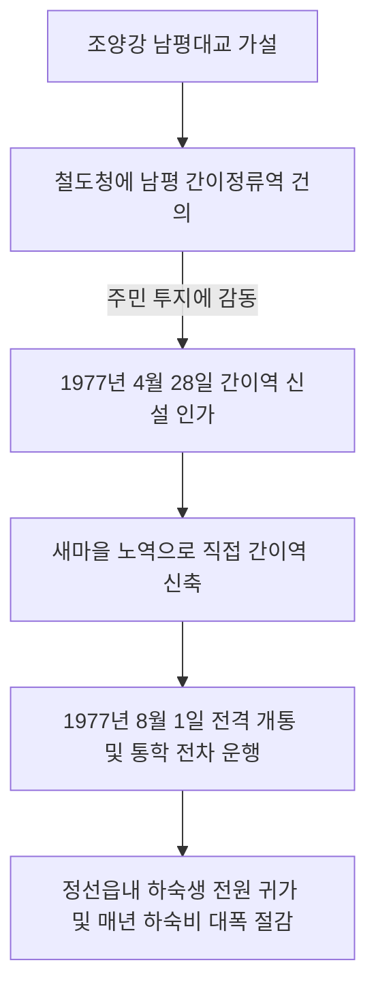

# 강원 정선군 북면 남평리 — 조양강 청류에 세운 170미터 남평대교, 간이역 신설과 기적의 황무지 개답

---

## 1. 마을 개황 및 격절되었던 산간 오지의 비극

### 가. 조양강에 가로막혀 고립되었던 강원도 산골
강원도 정선군 북면 남평리는 사방이 가파른 태백산맥의 웅장한 봉우리로 둘러싸인 산간벽지였습니다. 특히 마을 앞을 도도히 흐르는 **조양강(朝陽江)**은 남평리 1,600여 주민들의 삶을 철저히 고립시키는 자연의 거대한 장벽이었습니다.

* **목숨을 건 나룻배 통행**: 주민들은 평생 조양강의 위태로운 목선(나룻배) 한 척에 의존하여 통행해야 했습니다. 매년 삼복장마철이 되면 강물이 무섭게 불어나 교통이 완벽히 절량되었고, 겨울철 결빙기에는 두껍게 얼어붙은 강 얼음 위를 위태롭게 건너다 빠지는 안전사고가 끊이지 않았습니다.
* **통학생들의 설움**: 남평리의 초·중·고등학생 160여 명은 비가 오거나 강이 얼 때마다 학교에 가지 못해 발만 동동 굴러야 했습니다. 중·고생들은 이 통학 곤란 때문에 멀리 정선읍내에 방을 얻어 눈물겨운 하숙이나 자취 생활을 해야만 해, 영세 가구의 가계에 막대한 경제적 부담을 지우고 있었습니다.

### 나. 옥수수 밭떼기 중심의 영세한 소득
마을 뒤편은 험준한 산이었고 앞은 돌투성이 황무지였습니다. 물을 댈 수 있는 논(답)이 없어 척박한 비탈밭에 옥수수와 감자를 겨우 심어 목구멍에 풀칠하는 영세 농가가 대부분이었습니다. 가구당 연평균 소득은 겨우 **300,000원**에 머물러 늘 춘궁기의 한 많은 굶주림과 싸워야 했던 비운의 오지였습니다.

---

## 2. 남평대교 가설의 대업과 감동의 합동 투쟁 (1977년)

### 가. 높이 8m, 길이 170m '남평대교' 가설 착공
주민들은 더 이상 가난과 고립을 대물림할 수 없다고 결심했습니다. 1976년 말, 마을 총회에서 주민들은 자조와 협동의 새마을 정신으로 조양강을 정복하기 위한 **'남평대교 가설 추진위원회'**를 구성했습니다. 

### 나. 감동을 자아낸 주민들의 솔선수범과 미담
* **👴 [미담 1] 69세 노구 이윤영 추진위원장의 겨울 수중 투쟁**: 69세의 노령이었던 **이윤영** 추진위원장은 공사 현장의 임시 막사에서 하루도 빠짐없이 숙직하며 작업을 진두지휘했습니다. 특히 칼바람이 부는 혹한의 겨울철, 얼음장 같은 강물 속에 가장 먼저 뛰어들어 교각 가설 작업을 직접 수행하는 솔선수범을 보여주어 온 청년들의 가슴을 울렸고, 주민들의 자발적인 참여를 이끌어내는 결정적 원동력이 되었습니다.
* **🤝 [미담 2] 마증선 씨의 300평 부지 무상 대여**: 주민 **마증선** 씨는 공사용 자재 저장소와 현장 사무실로 사용할 수 있도록 자신의 요지 **300평을 2년간 아무런 대가 없이 무상으로 대여**해 주었으며, 고가의 공사 도구들을 아낌없이 빌려주어 교량 가설의 든든한 기술적 버팀목이 되어주었습니다.
* **🎒 [미담 3] 하굣길 고사리손의 30분 골재 나르기**: 남평리 초·중·고등학생 160명은 매일 학교가 끝나면 집으로 돌아가기 전, 강변에서 **30분씩 교각 공사에 쓰일 골재(자갈과 모래)를 손으로 나르는 노력 봉사**를 자청했습니다. 아이들의 고사리손을 본 현장의 어른들은 눈시울을 붉히며 더 힘을 내어 작업을 이어갔습니다.

### 다. 준공식의 눈물바다 (1977년 10월 22일)
마침내 10개의 거대한 콘크리트 교각이 완공되고 상판 교판 작업이 빈틈없는 밀착 검사 속에 완료되었습니다. 1977년 10월 22일, 남평대교 준공식이 거행되었습니다. 
* **84세 유경옥 옹의 눈물**: 어릴 때부터 평생 배만 타고 위태롭게 강을 건너야 했던 **유경옥(84)** 옹은 감격에 겨워 눈물을 흘리며 *"내 평생에 이 푸른 조양강을 내 발로 걸어서 다리로 건너는 날이 올 줄은 꿈에도 몰랐다"*라며 다리 위를 오랫동안 떠나지 못했습니다. 온 주민들이 마침내 완성된 교량을 부둥켜안고 감격의 눈물을 쏟아내며 준공식장은 눈물바다를 이루었습니다.

---

## 3. 철도청을 감동시킨 '남평 간이역' 신설 기적

남평대교 가설로 강을 건널 수 있게 되었으나, 여전히 마을을 지나는 열차 정류장은 무려 6km나 떨어져 있었습니다. 주민들은 통학생들의 불편을 근본적으로 타개하기 위해 남평대교와 바로 접속되는 **철도 간이정류역 신설**을 철도청에 건의했습니다.

* **주민들의 자력 간이역 건설**: 주민들의 가열찬 투지에 감동한 철도청은 **1977년 4월 28일 간이역 신설을 공식 인가**했습니다. 주민들은 또다시 새마을 노역을 통해 스스로 역 플랫폼과 대기실을 지어 올렸고, **1977년 8월 1일 영광스러운 남평 간이역 개통**을 보게 되었습니다. 정선읍내에서 비싼 방세를 내며 하숙하던 수십 명의 중고생들이 마침내 집에서 부모가 해주는 따뜻한 밥을 먹으며 안전하게 기차로 통학할 수 있게 되었습니다.

---

## 4. 밭을 논으로 바꾼 개답과 주거 환경의 천지개벽

### 가. 척박한 밭 42ha의 경이로운 논(답) 개착
남평대교 가설과 함께 주민들은 대대적인 토지 개조 사업에 돌입했습니다.
* **제방 및 양수장 준공**: 조양강변의 버려진 황무지 4ha와 옥수수 농사만 짓던 척박한 비탈밭 42ha를 개간(개답)하기 위해 800m의 대규모 보호 제방을 축조하고 양수장 1개소를 건설했습니다.
* **3,800m 도수로 가설**: 양수기 2대를 구입하고 3,800m에 달하는 농업용 도수로를 건설하여 한 방울의 물도 대기 어렵던 비탈밭에 조양강 푸른 물을 끌어왔습니다. 그 결과 1977년 첫 수확에서만 무려 **188톤의 청정 백미를 생산**하여 마을의 식량 자립을 100% 실천해 냈습니다.

### 나. 374건의 종합 주거 환경 정비 실적
남평리는 1977년 한 해 동안 마을의 외관을 획기적으로 뜯어고쳐, 농촌 근대화의 최고 선봉 마을로 도약했습니다.

* **지붕 개량 및 도색**: 마을 전 농가 초가지붕 철거 및 현대식 도색 완료.
* **기반 정비 실적**: **콘크리트 하수구 800m 가설, 규격화된 위생 퇴비장 258동 신축, 마을 진입로 250m 확포장 완료.**
* **최고 영예 획득**: 이러한 성과를 인정받아 **1978년 3월 정부의 '월간 경제동향보고' 전국 최우수 시범 마을**로 공식 선정되는 불멸의 위업을 달성했습니다.

---

## 5. 소득 신장 및 미래 도약 계획 (1980년대)

* **농가 소득의 획기적 수직 신장**: 1970년대 초 가구당 평균 소득 30만 원에 불과했던 영세 산골 마을이, 대교 건설과 논 개간 및 가전제품과 농기계 도입을 통해 1977년 말 기준 가구당 무려 **1,700,000원**의 경이로운 소득을 거양했습니다.
* **80년대 목표 240만 원 정진**: 남평리 주민들은 이에 만족하지 않고, 조양강 보호 제방 4,000m를 추가 증축하여 40ha의 논을 더 개간할 계획입니다. 또한 농가당 한우를 3두 이상 사육하는 축산 단지 조성을 적극 추진하며, 이웃 북평리와 연결하는 제2의 교량을 가설하여 80년대 가구당 평균 소득 **2,400,000원** 고지를 향해 새마을 정신으로 굳건히 전진하고 있습니다.

---
*(출처: 영광의 발자취 - 마을 단위 새마을운동 추진사 제1집)*
