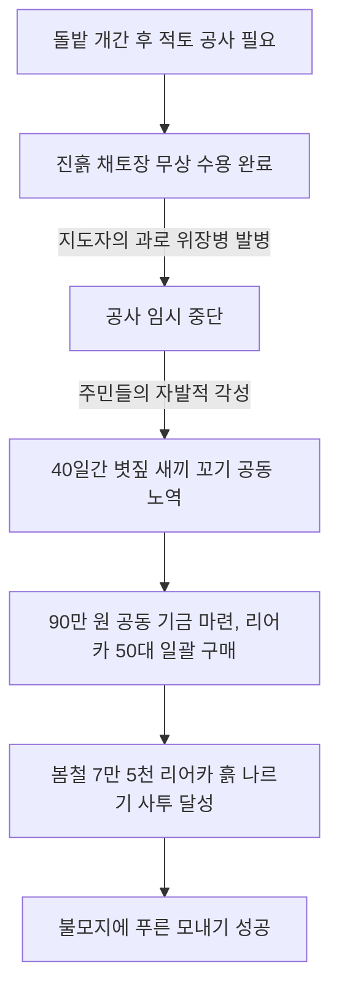

# 강원 양구군 양구면 도사리마을 — 철모 두레박과 전쟁 폐허를 딛고 일어선 피난민들의 집념, 지하 동굴 수로와 7만 리어카 흙 나르기로 이룩한 자립 복지촌

---

## 1. 마을 개황 및 전쟁의 상흔과 패배주의의 세월

### 가. 수복지구 전쟁 피난민들의 정착과 절망
강원도 양구군 양구면 도사리마을은 한국전쟁 이후 영토를 수복한 휴전선 인근 최전방 접적지구였습니다. 전쟁으로 국토 전체가 초토화된 폐허 속에서 전국 각지에서 흘러 들어온 피난민(전재민)들이 산비탈과 돌밭에 무작저 정착하면서 부락을 이루었습니다.

* **참혹했던 주거 환경**: 마을의 67호 가구 전체가 쓰러져가는 임시 초가집과 가마니로 덮은 토담 움막이었습니다. 마을 안길이 전혀 없어 리어카조차 다닐 수 없었습니다. 앞개울에는 제대로 된 다리가 없어 작은 비만 내려도 징검다리가 물에 잠겼고, 아침 일찍 학교에 가려던 어린 학생들은 책가방을 메고 불어난 강물 앞에서 울음을 터뜨리기 일쑤였습니다. 징검다리를 건너다 아이들이 급류에 휩쓸려 큰 변을 당하는 일도 잦았습니다.
* **군용 고물이 지배한 생활상**: 뽀얀 먼지와 잡초만 가득한 마을에서 사람이 산다는 것 자체가 기적이었습니다. 전기가 가설되지 않아 호롱불 밑에서 긴 한겨울 밤을 추위에 떨며 지새웠습니다. 주민들은 전쟁의 부산물인 군용 폐기물을 일상 도구로 사용했는데, **구멍 난 군용 철모(헬멧)를 두레박 삼아 우물 물을 길었고**, 버려진 군화로 신발을 대신했으며, 낡은 군용 담요와 오버코트를 이불과 외출복 삼아 걸치고 신세타령으로 일관했습니다.

### 나. 7개의 선술집과 도박으로 얼룩진 불량 풍습
주민들은 가혹한 가난을 전쟁이 안겨준 피할 수 없는 숙명으로 여겼습니다. *"총소리가 울리는 최전방 눈앞에 적을 두고 여기서 내 땅도 아닌데 무슨 노력을 하겠느냐"*라는 극심한 체념에 빠져 도박과 술로 하루하루를 보냈습니다. 인가 수십 호밖에 안 되는 작은 골짜기 마을에 술집만 무려 7곳이 성업했고, 도사리는 인근 이웃 마을로부터 *"도박꾼 소굴", "가게 술집만 많은 거지 동네"*라며 조롱과 손가락질을 한몸에 받았습니다. 가구당 연평균 소득은 겨우 **280,000원**이었고, 70%가 넘는 주민들이 봄철에 풀뿌리로 연명하는 절량농가(絶糧農家)였습니다.

---

## 2. 이강섭 지도자의 벼랑 끝 투쟁과 7대 선술집의 박멸 (1970년)

### 가. 도박판의 문을 박차고 들어간 상처투성이 지도자
* **지도자 이강섭(2년간의 경찰관 및 6년간의 군 복무 경력)**: 1959년 군 복무를 마치고 이 가난한 도사리에 이주해 왔습니다. 청년회장을 거쳐 1964년 이장에 선출되며 고향 재건에 헌신했습니다. 1970년 전국적으로 새마을운동의 불길이 당겨졌으나 도사리 주민들은 냉소적이었습니다.
* **눈물의 입원 투쟁**: 1970년 추운 겨울날, 이강섭 지도자는 주민들이 푼돈을 걸고 날밤을 지새우는 도박판의 문을 박차고 들어갔습니다. *"여러분! 언제까지 이 참혹한 거지 노릇을 후손에게 대물림할 것입니까? 당장 도박 카드를 찢고 들판으로 나가 가난을 물리칩시다!"*라며 목놓아 소리쳤습니다. 그러나 돌아온 것은 거친 폭력과 매질이었습니다. 이 지도자는 반대파들에게 몰매를 맞아 피투성이가 된 채 병원에 입원하여 일주일 동안 일어나지 못했습니다. 
* **애향심의 각성**: 이 소식을 들은 주민들은 서서히 양심의 가책을 느끼기 시작했습니다. 이 지도자는 퇴원하자마자 지팡이를 짚고 주민들을 일일이 찾아다니며 *"외지에서 피난 온 우리들이 정착해 살 수 있는 유일한 고향은 여기다. 여기가 내 뼈를 묻을 내 고향이라는 애향심을 갖자"*라며 눈물로 호소했고, 마침내 도사리 주민들은 비아냥을 멈추고 새마을 사업에 동참하기 위해 삽과 괭이를 집어 들었습니다.

---

## 3. 영하 30도 혹한 속 '지하 굴옥 터널 수로'와 개답의 기적 (1973년)

### 가. 물 한 방울 안 나는 돌밭에 물을 끌어오다
이 지도자는 가난을 면하기 위해서는 버려진 자갈밭(불모지)을 깎아 벼농사를 지을 수 있는 논으로 개간(개답)해야 한다고 확신했습니다. 
* **반대를 이겨낸 지혜**: 완고한 노인들은 *"물 한 방울 안 흘러나오는 마른 개울에 논을 만들어봤자 무슨 수로 물을 대느냐"*라며 극구 반대했습니다. 이 지도자는 개울 바닥 깊숙이 사시사철 지하수가 흐르고 있음을 감지하고, 수로를 따라 속을 둥글게 도려낸 터널식 돌배수로인 **'굴옥(窟屋) 지하 터널 수로'**를 지하에 설치하면 충분히 안전한 농업용수를 공급할 수 있다고 설명하며 주민들을 완벽하게 설득해 냈습니다.

### 나. 영하 20~30도 한파 속의 사투
1973년 12월 18일, 살을 에는 듯한 강원도 최전방의 영하 20~30도 살인적인 혹한 속에서 기공식이 거행되었습니다. 매일 장정 100여 명이 입김으로 언 손을 녹여가며 가파른 바위산을 깨뜨려 나갔습니다.
* **눈보라 속의 썰매 수송**: 논두렁과 둑을 쌓기 위해 엄청난 양의 무거운 돌덩이를 날라야 했습니다. 장정들은 나무 썰매와 등짐으로 돌을 날랐고, 아낙네들은 머리로 돌덩이를 이고 눈길을 헤쳐 나갔습니다. 매서운 칼바람에 미끄러져 척추를 다치고 손발에 깊은 동상을 입어 손가락이 잘려 나가는 혹독한 고통을 이겨내며 150여 트럭분에 달하는 돌을 파내고 마침내 굴옥 수로를 지하에 매설하는 데 성공했습니다.

---

## 4. 지도자의 위장병과 주민들의 '7만 5천 리어카 적토 수송' (1974년)

### 가. 흙 한 줌 없는 돌밭에 붉은 찰흙을 입히다
돌과 모래뿐인 척박한 개답지는 물과 영양분을 가둘 수 없어 벼가 자라지 못했습니다. 이를 극복하려면 비옥한 진흙을 퍼와 밭 전체를 두껍게 덮어 섞는 **'적토(客土) 공사'**가 절대적이었습니다. 그러나 도사리 안에는 진흙을 캘 수 있는 땅을 가진 지주가 없었습니다.

* **20리 밖 지주의 설득**: 이 지도자는 비옥한 찰흙 대지를 소유한 20리 밖 외지 지주를 **무려 여섯 번이나 찾아가 무릎을 꿇고 애원**한 끝에 마침내 채토(흙 파내기) 무상 승낙을 받아냈습니다.
* **지도자의 위장병 발병과 공사 중단**: 밤낮없는 중노동에 쇠약해진 이강섭 지도자는 신경성 위장병이 도져 자리에 누웠고 한파가 몰아쳐 적토 공사는 임시 중단되었습니다.

### 나. 40일간 새끼를 꼬아 리어카 50대를 사들인 주민들
공사가 일시 중단된 절망적인 40일 동안, 도사리 주민들은 한 명도 놀지 않았습니다. 사랑방에 모여 도박을 하던 손으로 밤낮없이 볏짚 새끼를 꼬았습니다. 새끼를 팔아 모은 **공동 기금 900,000원으로 흙을 실어 나를 최신 리어카 50대를 전격 구입**하여 몸져누운 지도자에게 용기를 불어넣었습니다.

* **7만 5,000 리어카의 사투**: 이듬해 봄, 건강을 미처 회복하지 못한 지도자가 비틀거리며 개공 현장에 나타나자 온 주민들이 힘찬 함성을 지르며 흙을 퍼 날랐습니다. 60일 동안 주민들의 맨손으로 퍼 날라진 비옥한 황토 찰흙은 무려 **75,000 리어카 (대형 덤프트럭 3,000대 분량)**에 달하는 경이적인 수치였습니다. 지쳐 쓰러지면서도 끝내 포기하지 않는 주민들의 뜨거운 강인함은 불모의 돌밭을 완벽한 옥토로 바꾸어 모내기를 훌륭하게 완수해 냈습니다.

---

## 5. 자립 환경의 완성 및 양구군 최고 소득 마을 도약 (1976년)

* **도사리 공동 구판장 개설**: 주민들은 소득 증대를 위해 중간 상인들의 폭리를 차단하는 마을 공동 구판장을 개설하고, 주민 생활 백서와 교육 도서 380권을 확보한 도서관을 지었습니다.
* **양구군 최고 소득 마을 등극 (1976년)**: 70년대 초 가구당 소득 28만 원에 전형적인 절량 난민촌이었던 도사리마을은 불모지 개답 사업의 성공과 고추·엽채류 기계화 특화 경작을 통해, 1976년 말 기준 **가구당 평균 소득 1,380,000원**을 조기 돌파하며 **양구군 전체에서 호당 소득이 가장 높은 대한민국 최고 최선진 마을**로 우뚝 서는 위대한 이주민 신화를 이룩했습니다.

---
*(출처: 영광의 발자취 - 마을 단위 새마을운동 추진사 제1집)*
