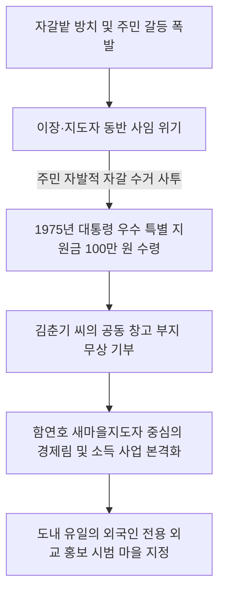

# 강원 명주군 성산면 금산2리 — 천년 은동(銀杏)의 향학에서 이룩한 수도권 외교 홍보 1호 시범촌, 완고한 양반 풍습을 깨부수고 소득의 기적을 쓰다

---

## 1. 마을 개황 및 유학 전통의 보수성과 가난의 늪

### 가. 천년 거목과 사대부의 숨결이 깃든 건금(建金)마을
강원도 명주군 성산면 금산2리(건금마을)는 한나라 무제 시기부터 유서 깊은 역사를 자랑해 온 고장이자, 영동 지역을 대표하는 **강릉 김씨(江陵 金氏)** 가문의 전통적인 대단위 집성촌이었습니다.

* **뿌리 깊은 역사 문화유산**: 마을 중심에는 둘레 12m에 달하는 **1,000년 묵은 천연기념물급 은행나무 거목**이 든든하게 자리하고 있어 마을의 장구한 역사를 증명하고 있었고, 지방유형문화재 제46호인 조선시대 사대부 가옥 **'임경당(臨鏡堂)'**과 울창한 송림이 어우러져 한 폭의 동양화 같은 아름다운 자태를 간직하고 있었습니다.
* **유교 관념의 병폐, '육체노동 천시'**: 조선시대 유학 사상에 물든 유림과 사대부들의 전통이 깊다 보니, 역설적으로 주민들의 의식 속에는 **"양반은 육체노동을 하지 않는다"**는 완고한 봉건 사상이 깊이 뿌리박혀 있었습니다. 땀 흘려 일하는 농사일을 천히 여겨 자식들에게 *"무슨 일이 있어도 농사만은 짓지 말라"*고 가르쳐 일손이 항상 나태하고 게을렀습니다.
* **씨족 갈등과 가난의 대물림**: 문향(文香)의 고장이라는 자부심과 달리, 성씨 다른 집안 간의 세력 다툼과 문중 내 계파 갈등이 극심했습니다. 틈만 나면 동네 주막에 모여 음주와 욕설, 사나운 주먹다짐이 끊이지 않았습니다. 가구당 연평균 소득은 겨우 **285,000원**에 불과해 전체 가구의 43%가 0.5ha 이하의 척박한 비탈밭에 목숨을 건 소작농이었으며, 매년 봄철이면 식량이 없어 굶어 죽는 절량농가가 속출하는 빛 좋은 개살구 마을이었습니다.

---

## 2. 무리한 경지정리와 주민 폭동의 위기 (1974년)

### 가. 벼랑 끝에 몰린 마을 대수술
1970년대 새마을 기적이 번지자, **김선기(金善起)** 이장은 마을을 전면 개조하기 위해 **'경지정리사업'**과 **'불량 주택 이주개량사업'**을 동시에 밀어붙였습니다. 
* **지도자 김선기의 대지 200평 기증**: 대규모 구획정리와 안길 확장을 위해 땅이 필요하자, 김선기 이장은 **자신의 소유 토지 200평을 선뜻 희사**하며 반대 주민들을 설득, 대공사의 물꼬를 텄습니다.

### 나. "다 굶어 죽게 됐다!" — 리장의 사임과 폭동 위기
그러나 주민들의 자금력을 초과한 과도한 동시 공사 추진은 온 동네를 빚더미에 올라앉게 만들었습니다. 설상가상으로 1974년 봄, 중장비가 논밭을 밀어붙이고 간 마무리 단계에서 **강바닥의 엄청난 돌덩이와 자갈 수백 트럭 분량이 논 전체에 파헤쳐진 채 방치**되는 전대미문의 사태가 벌어졌습니다.
* **경작 불능의 대위기**: 당장 모내기를 해야 하는 영농기가 코앞인데 논 전체가 자갈밭으로 변해 괭이질조차 할 수 없었습니다. 격노한 주민들은 쇠몽둥이와 삽을 들고 김선기 이장의 집으로 몰려와 파상적인 폭동을 일으켰습니다. 
* **분노한 주민들의 항의**: *"새마을을 한답시고 멀쩡한 논을 자갈밭으로 만들어 우리를 굶겨 죽이려 하느냐! 경지 정리로 생긴 모든 가계 빚을 리장 네가 다 떠안고, 당장 굶어 죽을 우리 식구들을 먹여 살려내라!"*라며 사생결단으로 멱살을 잡고 협박했습니다. 육체적·정신적 한계에 부딪힌 김선기 이장과 **김장기** 새마을지도자는 더 이상 감당하지 못하고 전격 사임서를 제출하며 마을 재건 사업은 완전히 파탄 날 위기에 직면했습니다.

---

## 3. 대통령 특별 지원금 100만 원과 협동의 부활 (1975~1976년)

### 가. 꺼진 불씨를 살린 최우수 시범마을 특별금 수령
주민들은 이대로 무너지면 대대손손 거지 신세를 면치 못한다는 절박한 자각을 갖게 되었습니다. 주민들은 눈물로 자갈밭의 돌을 손으로 골라내며 모내기를 완수했고, 이 눈물겨운 자구 노력에 감동한 정부는 **1975년 가을, 대통령 우수 새마을 특별지원금 100만 원**을 금산2리에 전격 배정했습니다. 

### 나. 김춘기 씨의 애향심과 함연호 새마을지도자의 활약
* **김춘기 씨의 창고 대지 희사**: 대통령 특별 자금으로 마을 공동 창고를 지으려 했으나 대지가 없자, 주민 **김춘기(金春起)** 씨가 자신의 애지중지하던 요지 땅을 마을 공동 창고 건립 용지로 선뜻 기증했습니다. 그의 거룩한 희생은 온 주민을 다시 하나로 묶어주는 협동의 불씨가 되었습니다.

* **함연호 지도자의 소득 다각화**: 새로 취임한 **함연호(咸演鎬)** 새마을지도자는 양반들의 노동 회피 풍습을 불식시키고, 농가 소득 다각화를 위해 1968년부터 소규모로 진행되던 비육우 사육 사업을 마을 전체 공동 사업으로 대대적으로 격상시켰습니다. 36세대의 간이 급수시설을 설치하고, 밤나무 묘목 식재와 새마을금고를 직접 조직해 가동 1년 만에 120만 원의 막대한 공동 자산을 축적했습니다.

---

## 4. 도내 유일 '외국인 홍보대상마을' 지정 및 문명화 성과

금산2리의 천지개벽한 변화는 국가적 차원의 인정을 받아, **1977년 강원도 유일의 '외국인 홍보 대상 시범마을'**로 공식 지정되는 영예를 안았습니다. 전 세계 외교관들과 해외 시찰단이 한국 새마을운동의 기적을 눈으로 확인하기 위해 매일 금산2리의 천년 은행나무 아래를 가득 메웠습니다.

### 🏠 금산2리 문명 현대화 성과 및 가전 보급 현황 (1977년 말 기준)

| 구분 | 주요 사업 성과 내용 | 보유 농기구 및 문화 자산 |
| :--- | :--- | :--- |
| **인프라 혁신** | • 마을 진입로 350m 시멘트 완전 포장 • 간이 급수수도 36세대 보급 • 마을 역사 이래 **최초의 체신 전화 개통** | • 경운기 15대 • 리어카 84대 • 탈곡기 52대 • 동력분무기 64대 |
| **주거 위생 개조** | • 재래식 편소 100% 철거 및 수세식 변기 설치 • 전 가구 부엌 바닥 컬러 타일 시공 및 주택 도색 완료 | • 텔레비전 53대 • 라디오 74대 • 마을 문고 도서 380권 |
| **국가 포상** | • 전 주민의 단합 공로로 **전국새마을 포장 수훈** | • 새마을금고 자산 120만 원 확보 |

> [!NOTE]
> 유교적 사대부 관념에 찌들어 노동을 천시하던 강릉 김씨 집성촌 금산2리는, 벼랑 끝의 자갈밭 폭동 위기를 뜨거운 향토애와 단결로 극복하고 **국내외 외교관들이 극찬하는 세계적 수준의 친환경 외교 복지 시범 마을**로 우뚝 섰습니다.

---
*(출처: 영광의 발자취 - 마을 단위 새마을운동 추진사 제1집)*
