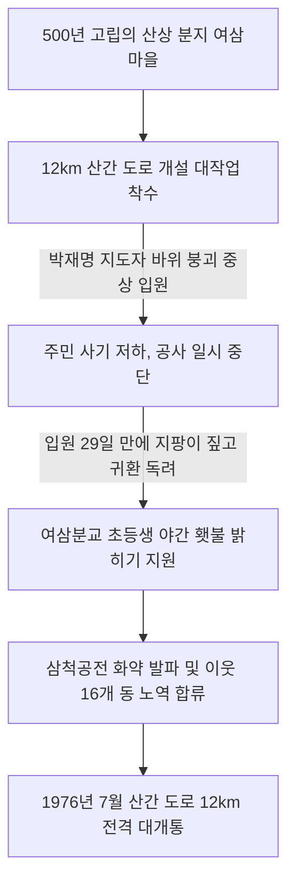

# 강원 삼척군 노곡면 여삼마을 — 맹물 한 방울 안 나던 500년 석회암 불모지, 횃불과 다이너마이트로 뚫어낸 12km 산간 도로와 억대 장뇌삼의 기적

---

## 1. 마을 개황 및 원시와도 같았던 고립무원의 비극

### 가. 비 한 방울 오면 지하로 사라지는 메마른 고산 분지
강원도 삼척군 노곡면 여삼마을은 해발 350m 태백산맥 산꼭대기에 위치한 사방이 꽉 막힌 오지 중의 오지였습니다. 세종 25년(1445년) 피난민들에 의해 형성된 이래 500년 동안 문명 세계와는 완전히 동떨어져 있었습니다.

* **하천도 우물도 없는 물 기근 지대**: 여삼마을은 특이하게도 지층 전체가 거대한 **석회암 암반 지대**로 형성되어 있었습니다. 이 때문에 비가 내리더라도 빗물이 석회암 싱크홀(배수 침강지)을 통해 순식간에 지하 깊숙이 빠져나가 버렸습니다. 마을 내에는 흐르는 개울(하천)이 전혀 없었으며, 우물을 파도 물 한 방울 나오지 않아 **'논(답)이 단 한 평도 존재하지 않는'** 메마른 불모의 땅이었습니다.
* **목욕조차 불가했던 비참한 생활상**: 70호 가구 전체가 흙벽에 나무껍질을 얹은 굴피집이나 나무 판자를 얹은 너와집이었습니다. 마을 내에 식수가 없어 주민들은 **"평생 목욕이라는 것을 아예 상상조차 하지 못하고"** 살았으며, 온 동네의 세탁물을 이리저리 모아 두었다가 무려 6km나 떨어진 이웃 마을 개울까지 지고 가서 빨래를 하거나 겨울철 눈을 녹인 땟물로 겨우 위생을 해결해야 했던, 그야말로 문명에서 소외된 고대 원시인과 다름없는 참담한 살림살이였습니다.

### 나. 맹목적 체념과 깊은 도박 풍습
사방 12km 안에는 인근 면사무소나 전통시장으로 연결되는 최소한의 우마차 길조차 없었습니다. 주민들은 이 험난한 운명을 조상의 가혹한 업보로 돌리며 깊은 패배주의에 젖어 살았습니다. 농한기만 되면 좁은 방구석에 옹기종기 모여 앉아 매일 밤 외상술을 마시며 화투 도박판을 벌여 가산을 탕진하는 퇴폐적 풍습만이 가득했습니다.

---

## 2. 12km 산악 고갯길 개척과 박재명 지도자의 지팡이 투쟁 (1973~1976년)

### 가. 장정 연인원 46,000명의 3년 5개월 사투
여삼마을 주민들은 500년의 격리를 허물기 위해 삼척시내와 노곡면을 연결하는 **'12km 대규모 산간 도로 개설'**이라는 무모해 보이는 대업을 결정했습니다. 

* **기적의 총동원**: **1973년 2월부터 1976년 7월까지 무려 3년 5개월** 동안, 눈비가 몰아치는 강추위와 숨이 턱턱 막히는 한여름 염천을 무릅쓰고 **남녀노소 연인원 46,000명**이 공사에 참여했습니다. 이는 가구당 매년 6개월 이상을 꼬박 도로 개설 공사에 바친 경이적인 헌신이었습니다.
* **10배의 가치 창출**: 정부 지원금은 고작 820만 원이었으나, 주민들은 순수한 피와 땀으로 무려 **1억 2,000만 원 상당의 최신 전천후 도로**를 산꼭대기에 뚫어내 세상을 경악시켰습니다.

### 나. 지팡이에 의지해 작업장으로 돌아온 박재명 지도자
공사는 거대한 석회암 바위를 정으로 깨고 다이너마이트로 발파해야 하는 극도로 위험한 노역이었습니다. 
* **지도자의 뼈아픈 부상**: 작업 도중 **박재명(朴在明)** 새마을지도자가 굴러떨어지는 무거운 바위에 깔려 척추와 다리에 심각한 중상을 입고 병원에 긴급 이송되었습니다. 지도자가 쓰러지자 현장의 사기는 급격히 꺾였고 공사는 중단될 위기에 처했습니다.
* **눈물의 지팡이 독려**: 입원한 지 단 29일 만에, 뼈가 채 붙지 않아 거동이 불가능했던 박 지도자는 병원 침대를 박차고 나왔습니다. 그는 **아내의 어깨를 짚고 부축받으며 한 손에는 나무 지팡이를 짚은 채 비틀거리며 공사 현장**에 다시 섰습니다. *"주민 여러분! 우리가 우리 대에 이 바위 고갯길을 뚫어내지 못하면 우리의 자식들은 평생 씻지도 못하고 평생 이 메마른 산꼭대기에서 가난의 노예로 굶어 죽어야 합니다! 내 몸은 으스러져도 좋으니 제발 삽을 들고 일어나 주십시오!"*라며 피를 토하듯 절규했습니다. 이에 감동한 주민들은 일제히 괭이를 집어 들고 바위를 깨부수기 시작했습니다.

### 다. 어린이 횃불대와 16개 마을의 온정 미담
* **🔥 여삼분교 고사리손의 야간 횃불대**: 밤낮없는 착암기와 다이너마이트 발파 작업을 돕기 위해, 여삼분교 초등학생들은 저녁마다 조를 짜서 **들판의 횃불을 들고 어른들이 발을 딛는 바위 절벽을 밝혀주는 눈물겨운 밤샘 지원**을 펼쳤습니다.
* **🤝 삼척공전과 노곡 16개 동의 연대 기적**: 삼척공업전문학교(학장 이성갑) 학생 연인원 1,459명이 콤프레샤와 착암기, 화약 발파 기술을 무상 지원해 주었고, 노곡면 관내 16개 이웃 마을 주민들이 *"여삼의 기적에 우리도 가만히 있을 수 없다"*라며 4년간 매 가구당 3일씩 자발적인 노역 동참 봉사를 해주어 향토 연대의 최고 정점을 보여주었습니다.

---

## 3. 사생결단으로 살려낸 특산품 '억대 장뇌삼(장뇌)' 발아 공법 개발

여삼마을은 고산 분지의 차갑고 척박한 기후를 기회로 삼아, 옛날부터 심산유곡에 자생하던 산삼 씨앗을 파종하여 재배하는 **'장뇌삼(장뇌)'**에 주목했습니다.

* **발아상 신공법 개발**: 장뇌삼은 약성이 뛰어난 고가의 영약이었으나, 야생 씨앗의 발아율이 극히 낮아 실패하기 일쑤였습니다. 박재명 지도자는 수년간 밤잠을 설쳐가며 산에서 흙을 퍼와 온도와 습도를 정밀 제어하는 **'새마을 전용 발아상'**을 자체적으로 설계·고안해 냈습니다.
* **억대 소득원 창출**: 이 발아 공법의 대성공으로 현재 마을 48호 가구가 600평의 대단위 장뇌삼 재배를 달성했습니다. 10년생 장뇌삼 한 뿌리가 당시 거액인 **8만 원**, 15~20년생이 **20만 원**에 팔려 나가면서, 여삼마을은 단숨에 **약 1억 원 상당의 유기농 장뇌삼 공동 자산을 확보한 대한민국 최고의 축산 영약 특화 부촌**으로 우뚝 섰습니다.

---

## 4. 대통령 각하 배석 성공사례 발표와 영예의 준공 (1976~1977년)

* **76년 12월 8일 대통령 배석 청와대 발표**: 박재명 지도자는 청와대에서 열린 월간 경제동향보고회에서 대통령 각하와 장관들 앞에서 여삼마을의 눈물겨운 12km 도로 신설 및 장뇌삼 성공 사례를 발표하여 깊은 감동을 선사했습니다.
* **대통령 전격 하사금 500만 원 수령**: 이 발표로 여삼마을은 **새마을훈장 협동장**을 서훈받았으며, 단체 대통령 표창과 함께 **5,000,000원의 파격적인 대통령 특별 하사금**을 수령하는 쾌거를 거두었습니다.
* **초현대식 여삼 새마을복지관 건립 (1977년 7월 8일 준공)**: 하사금 500만 원으로 주민들은 회의장, 이발소, 감자 분쇄실, 새마을금고, 대형 구판장이 일괄 배치된 복지관을 전격 건립하여 가난의 그림자를 영원히 씻어냈습니다.

---
*(출처: 영광의 발자취 - 마을 단위 새마을운동 추진사 제1집)*
