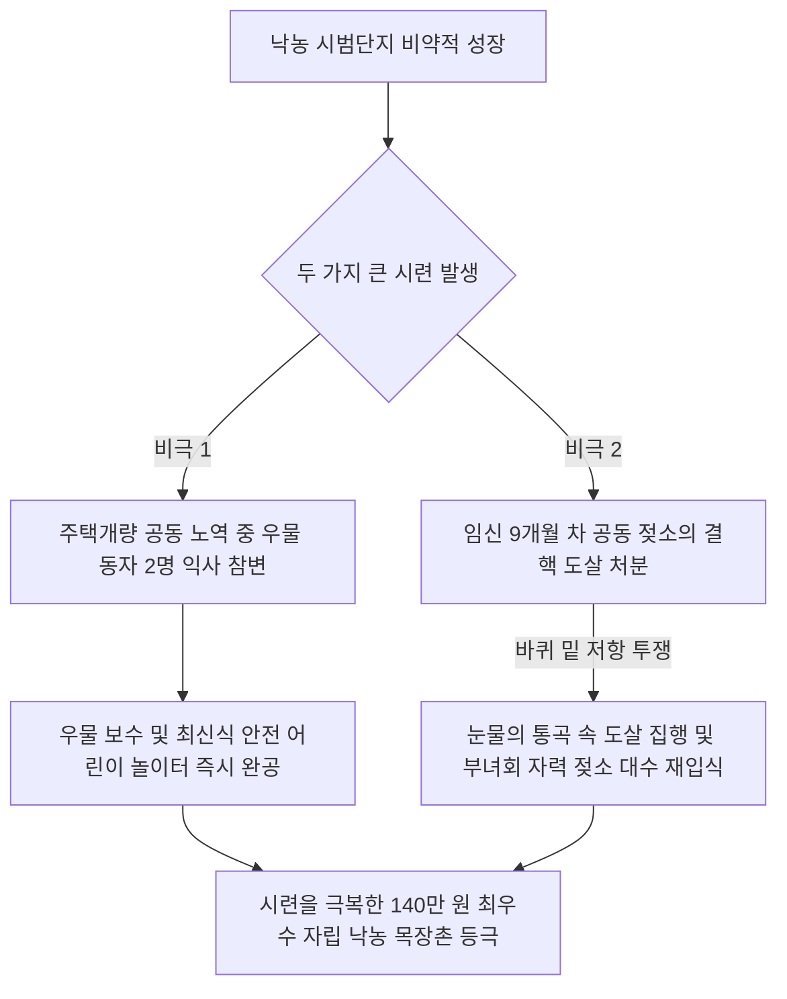

# 충북 청주시 율양동 상리 — 백화산 기슭의 낙농 개척 기적, 미 육군장관이 극찬한 은빛 목장과 눈물로 씻어낸 두 가지 비극

---

## 1. 마을 개황 및 척박한 화전민의 역사

### 가. 노름으로 전 재산을 날린 피난민이 일군 백화산 기슭
충청북도 청주시 율양동 상리(상리마을)는 청주시내 북쪽 밤고개를 넘어 백화산(白華山)과 상당산성(上黨山城) 기슭의 아늑한 골짜기에 자리 잡고 있었습니다. 

* **화전민들의 슬픈 정착사**: 이 마을은 조선 말기인 1870년경, 보은 지방에 살던 달성 서씨(達城 徐氏) 한 명이 노름으로 전 재산을 탕진하고 방랑하다가 이곳 백화산 기슭에 들어와 화전을 일구며 시작되었습니다. 이후 김해 김씨 가문이 합류해 울창한 삼림을 베어 숯과 땔감을 율봉역(栗峰驛)에 공급하며 연명하던 척박한 화전민촌이었습니다. 
* **모래와 돌뿐인 척박한 땅**: 지형 전체가 물을 대기 힘든 완만한 산비탈 지대로 토질이 극도로 메마르고 수원이 전혀 없었습니다. 수도작(벼농사)이 불가능하여 주민들은 절량 보릿고개를 매년 장리쌀로 연명하던 가난한 소작인들이 대부분이었습니다. 총 56호에 322명의 주민이 거주하고 있었습니다.

### 나. 역발상의 생존 전략, '낙농업(우유 생산)' 선택
주민들은 물 한 방울 나지 않는 산비탈 대지를 원망하는 대신, **"물이 없어도 자라는 목초를 심어 젖소를 기르자"**는 위대한 역발상 영농 전환에 착수했습니다. 산기슭의 거친 초지를 개간하여 목장용 풀을 심고 배합사료를 자체 배합하며 청주시 근교의 대규모 '낙농 시범 단지'로 도약하기 위한 기틀을 다져 나갔습니다.

---

## 2. 미 육군장관의 찬사와 청와대 영화 로케이션의 영예 (1976~1977년)

율양동 상리마을의 독창적인 낙농 공동체 성공은 국내를 넘어 세계적인 주목을 받기 시작했습니다.

* **🇺🇸 [외교 성과] 미 육군장관 알렉산더(Clifford Alexander)의 전격 방문**: **1977년 7월 8일, 미국 육군장관 알렉산더**가 비공식 한국 방문 중 국회의원의 안내로 가족 및 수행원 15명과 함께 전격 상리마을을 방문했습니다. 알렉산더 장관은 산비탈을 덮은 은빛 목장과 최신식 공동 축사, 주민들의 자립적인 낙농 생산 구조를 낱낱이 둘러본 뒤 *"지구상에서 가장 단결력이 뛰어나고 기적을 일궈낸 위대한 낙농촌"*이라며 극찬과 경의를 아끼지 않았습니다.
* **🎬 [문화 성과] 기록영화 「무심천(無心川)」 로케이션**: 1977년 8월, 청주시가 지역 대표 기록영화 「무심천」을 제작할 때, 낙농 현대화의 기적으로 상리마을이 단독 로케이션 촬영지로 낙점되었습니다. 온 동민들과 젖소 떼가 은막의 주인공으로 출연하여 전국 영화관에 상영되면서 상리는 전국적인 대스타 마을로 우뚝 섰습니다.
* **👧 [정부 포상] 영애 근혜 양으로부터 상사업비 직접 수령**: 1976년 충청북도 새마을 경진대회 1위를 차지한 상리마을은 **1977년 9월 20일, 전국새마을대회장에서 대통령 영애 근혜 양으로부터 직접 격려와 함께 상사업비 50만 원**을 수령하는 최고의 영예를 안았습니다.

---

## 3. 상리마을 주민들을 울린 눈물겨운 두 가지 비극

화려한 기적의 이면에는 상리 주민들이 함께 부둥켜안고 대성통곡해야 했던 뼈아픈 두 가지 비극이 숨어 있었습니다.

### 😢 [첫 번째 비극] 새마을 공동 일터에서 발생한 '동자(童子) 익사 참변'
1977년 5월 26일 오후 5시 36분경, 온 동네 주민들은 가구별 불량 건물을 대대적으로 헐어내고 새 벽돌집을 짓는 새마을 주택개량 사업장에서 피땀을 흘리고 있었습니다.
* **비극의 순간**: 부모들이 작업에 몰두하느라 잠시 시야에서 벗어난 사이, 이중훈 씨의 3남 명호(5) 군과 서동윤 씨의 3남 흥덕(5) 군이 동네 공동 빨래터 우물가에서 놀다가 미끄러져 동시에 익사하는 참변이 발생했습니다. 
* **동민들의 통곡**: 온 동민들이 마을의 대도약을 위해 하나의 공동 일터에서 일하던 도중 발생한 비극이었기에, 상리 주민들은 내 자식을 잃은 것처럼 가슴을 쥐어뜯으며 장례를 함께 치르고 대성통곡했습니다. 주민들은 아이들의 영혼을 달래기 위해 우물을 즉시 보수하고 영유아 전용 안전 어린이 놀이터를 전격 설치했습니다.

### 😢 [두 번째 비극] 9개월 만삭 젖소의 폐결핵 도살 처분 사건
1977년 5월 10일, 도 가축보건소의 일제 검진 도중, 마을의 가난을 해결해 줄 핵심 자산이자 공동 축사에서 애지중지 기르던 임신 9개월 차 공동 만삭 젖소 1두가 '우결핵(폐결핵)' 진단을 받았습니다.
* **가혹한 도살 명령과 주민들의 저항**: 법에 따라 즉시 도살 처분 명령이 내려졌습니다. 주민들은 소가 임신 9개월이므로 새끼를 낳을 수 있도록 딱 한 달만 도살을 연기하고 격리 수용해 달라고 도지사와 군청에 백방으로 탄원했으나 가차 없이 기각되었습니다.
* **1977년 9월 23일, 도살 트럭 압수 대치**: 소를 싣고 가기 위해 가축 수송 트럭이 들어온 날, 상리마을은 온통 초상집으로 변했습니다. 젖소는 트럭에 타지 않으려고 서럽게 울부짖었고, 감정이 격해진 부녀회원과 장정들은 **"소는 절대로 못 보낸다! 데려가려거든 우리를 깔고 가라!"며 차바퀴 밑에 드러누워 온몸으로 차를 가로막았습니다.** 
* **대성통곡의 길**: 지도자와 이장이 울먹이며 주민들을 눈물로 설득한 끝에 소를 실어 보냈을 때, 온 마을은 거대한 울음바다가 되었습니다. 훗날 도살장에 실려 간 소의 뱃속에서 나온 죽은 새끼가 그토록 고대하던 귀한 '암송아지'였다는 소식이 전해지자 주민들은 또 한 번 부둥켜안고 대성통곡을 했습니다.

---

## 4. 시련을 딛고 완성한 초현대식 공동 자산 현황

상리마을 주민들은 슬픔에 침잠하지 않고 더욱 억척스럽게 뭉쳤습니다. 동민들은 공동 젖소 입식과 새끼 꼬기, 밤나무 단지 조성으로 극복해 냈습니다.

* **경이로운 젖소 분만 기적**: 1975년 12월 첫 하사금 100만 원으로 고심 끝에 사 온 임신 젖소가 **단 1개월 만에 당시 시가 20만 원에 달하는 건강한 '암송아지'**를 출산했습니다. (수송아지는 고작 5천 원이던 시절) 주민들은 이를 신의 선물로 여기며 낙농업에 박차를 가했습니다.

### 🏢 청주 상리마을 연도별 새마을 종합 구축 실적

| 구분 | 주요 개발 사업 내역 | 총공사 비용 (원) | 실질적 복지 편의 성과 |
| :--- | :--- | :---: | :--- |
| **1973년** | • 마을 진입 안길 확장 (580m) • 소하천 정비 석축 쌓기 (100m) | **1,270,000** | 차량 왕래 최초 가동 및 수해 방지 |
| **1975년** | • 어린이 놀이터 설치 및 놀이기구 가설 • 공동 빨래터 우물 2개소 정비 및 위생 개조 • 밤나무 단지 조성 (1,800본 파종) | **2,030,000** | 아동 안전망 구축 및 소득 기반 조양 |
| **1976년** | • 55평형 시멘트 블록조 현대식 공동 축사 1동 신축 • 불량 가옥 및 쓰러져가는 빈민 가구 개축 (20동) • 마을 철제 규격 대문 교체 (19동) | **15,410,000** | 친환경 대단위 낙농 주거 인프라 정립 |
| **1977년** | • 마을 진입로 시멘트 완전 포장 (350m) • 통신 건의 전 가구 전기 및 체신 전화 개설 | **5,280,000** | 신작로 연계 전천후 문화 교통로 구축 |

> [!IMPORTANT]
> 두 아이의 익사와 만삭 젖소의 눈물겨운 도살이라는 모진 시련을 온 동민이 가족처럼 보살피며 이겨낸 청주 상리마을은, 백화산 척박한 비탈길을 **전 세계 외교관들이 견학하는 대한민국 1등 낙농 낙원 목장**으로 가꾸어 냈습니다.

---
*(출처: 영광의 발자취 - 마을 단위 새마을운동 추진사 제1집)*
