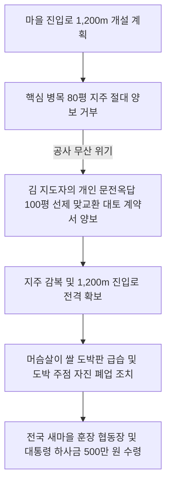

# 충북 보은군 내북면 산성2리 잣미마을 — 보청천 57미터 대교 가설과 청와대 현지 교육장 신화, 옥답을 내준 김 지도자의 구국적 도박 박멸 투쟁

---

## 1. 마을 개황 및 유서 깊은 산성 아래의 깊은 가난

### 가. 백제 노고성의 정기를 받은 잣나무 골짜기
충청북도 보은군 내북면 산성2리 잣미마을은 삼국시대 백제의 견고한 성터인 '노고성(老姑城)' 아래에 아늑하게 자리 잡은 유서 깊은 부락이었습니다. 

* **기초 환경 및 이름의 기원**: 마을 산기슭에 잣나무가 울창하여 예로부터 '잣미마을'로 불렸습니다. 하지만 수려한 풍광과 달리 보청천(報靑川)의 거친 강물에 가로막혀 우기마다 전 가구가 고립되는 산간 벽지였습니다.
* **가난의 늪과 도박의 해독**: 평야가 적어 임야를 일구는 화전과 영세 소작농이 대부분이었습니다. 절량농가가 매년 속출했고, 장리쌀을 빌려 겨우 겨울을 나던 주민들은 깊은 패배주의에 물들어 밤새 외상술을 마시며 좁은 방에 모여 화투 도박판을 벌이는 퇴폐적 악습이 대를 이어 가득했습니다.

### 나. 공직을 버리고 고향을 구원하러 온 인재, 김 지도자
이 잣미마을에 새로운 서막을 연 인물은 **김 지도자(원문 오타 '금지도자')**였습니다. 그는 보은농업고등학교를 우수한 성적으로 졸업하고, 이웃 괴산군청에서 안정적인 정식 공무원으로 근무하던 전도유망한 청년이었습니다. 
* **구국적 결단**: 그는 고향의 비참한 가난과 도박으로 얼룩진 현실을 그냥 볼 수 없어, 평생 보장된 괴산군청 공무원직을 미련 없이 사직하고 고향으로 귀환해 새마을지도자직을 자청하고 나섰습니다.

---

## 2. 57m 보청천 교량 가설과 옥답 대토의 투지 (1973년)

### 가. 한 많은 보청천 57m 대교 가설 착공
주민들은 여름철 집중호우 때마다 불어난 물에 가로막혀 징검다리를 건너지 못하고 발만 동동 굴러야 했습니다. 김 지도자는 잣미마을이 자립하기 위해서는 보청천을 가로지르는 대교 가설이 급선무라고 믿었습니다. 주민들을 설득해 양회 1,300포와 철근 5톤을 지원받아 **길이 57m의 웅장한 보청천 새마을대교** 가설에 돌입했습니다.
* **봄장마의 시련 극복**: 공사 도중 갑자기 밀어닥친 봄장마로 콘크리트 거푸집과 시멘트 50포대가 순식간에 물에 떠내려가는 시련을 겪었으나, 김 지도자는 실의에 빠진 주민들을 독려하여 끝내 다리를 자력으로 완공하는 기적을 낳았습니다.

### 나. 80평 도로 편입지를 위한 지도자의 '옥답 100평' 기증
교량 완공에 힘입어 1,200m의 마을 진입로 개설을 선언하자 또 다른 난관이 닥쳤습니다.
* **철거 반발과 도로 차단**: 도로 구역에 편입되는 땅의 소유주들과 담장 철거 대상 주민들이 총회 참석을 거부하며 거칠게 폭동을 일으켰습니다. 
* **지도자의 감동적인 대토 희사**: 특히 핵심 병목 구간의 토지 80평을 가진 지주가 절대 양보할 수 없다며 대치하자, 김 지도자는 **자신이 평생 일궈온 가문의 비옥한 문전옥답(논) 100평을 그 자리에서 교환해주겠다는 맞교환 각서**를 써주며 사재를 털어 땅을 매입, 도로 편입 문제를 일시에 해결해 세상을 울렸습니다.

---

## 3. 머슴 쌀 7가마니 도박판 급습과 주점 폐업의 결단

김 지도자는 가난을 퇴치하기 위해서는 마을 안의 퇴폐적 주막 난봉과 도박판을 전격적으로 뿌리 뽑아야 한다고 믿었습니다.

* **머슴의 피눈물을 닦아주다**: 어느 겨울날 밤, 이웃집 머슴이 평생 꼬박 일해 새경으로 받은 **귀중한 쌀 7가마니를 도박판에서 한순간에 몽땅 날리고** 절망해 자살하려는 부부 싸움 소리를 들었습니다. 김 지도자는 4-H 구락부 회원 6명과 몽둥이를 들고 도박장 문을 부수고 들어갔습니다. *"이 몹쓸 도박꾼들아! 남의 피눈물 어린 머슴살이 쌀을 노름판에서 빼앗아 가는 법이 어디 있느냐! 당장 돈을 돌려주고 해산하라!"*라며 기백 있게 일갈했습니다.
* **골절상 대결투와 경찰 해프닝**: 도박꾼들이 주먹을 휘두르며 난투극이 벌어졌고, 공교롭게도 그 과정에서 한 명의 팔이 부러지는 사고가 발생했습니다. 김 지도자와 대원들은 지서(파출소)의 긴급 긴급 호출을 당했으나, 주민을 도박에서 구원하려다 발생한 사정을 전해 들은 경찰지서장은 크게 감복하며 이들을 처벌하는 대신 훈계 방면하고 따뜻하게 위로해 돌려보냈습니다.
* **부녀회 협조로 주막 자진 폐점**: 이에 탄력을 받은 김 지도자는 부녀회원들과 파상적인 금주·반도박 운동을 전개해, 마을 내에서 성업 중이던 주점 주인들을 끊임없이 설득하여 **자진 폐업 조치**를 이끌어냄으로써 잣미마을의 도박 풍습을 역사 속으로 완벽히 매장시켰습니다.

---

## 4. 재해를 극복한 고등 원예 농업과 청와대 현지 교육장 승격

김 지도자는 주민들의 눈물 어린 단결을 생산 소득으로 승화시키기 위해 속리산 관광지 및 외지 대전에서 고가로 공급받던 채소 수요를 주목했습니다.

* **92련의 비닐하우스 대단지 구축**: 개인 대지 1,200평을 임차하여 대단위 비닐하우스 원예 재배(상추, 오이, 토마토, 고추)에 나섰습니다. 도중 돌풍에 하우스가 전파되어 모종이 냉해로 몰살당하는 천재지변을 이겨내고, 92련의 비닐하우스 고등 원예 특화 재배를 성공시켜 잣미마을을 보은군 최고의 고소득 시범 원예촌으로 도약시켰습니다.
* **새마을훈장 협동장 및 청와대 지원 수령**: 이러한 노력을 인정받아 잣미마을은 **1976년 12월 8일, 대통령 각하로부터 직접 새마을훈장 협동장**을 서훈받았으며, 단체 대통령 표창과 함께 **500만 원의 파격적인 특별 하사금**을 수령하는 쾌거를 거두었습니다.
* **전국 유일의 '중앙연수원 현지 교육장' 승격**: 잣미마을은 뛰어난 성과로 **새마을지도자 중앙연수원 현지 교육장**으로 공식 지정되어 전국에서 매달 수백 명의 이장과 지도자들이 3박 4일 일정으로 잣미의 성공 공식을 직접 배우기 위해 모여드는 전국 최고 명품 성지로 격상되었습니다.

---
*(출처: 영광의 발자취 - 마을 단위 새마을운동 추진사 제1집)*
