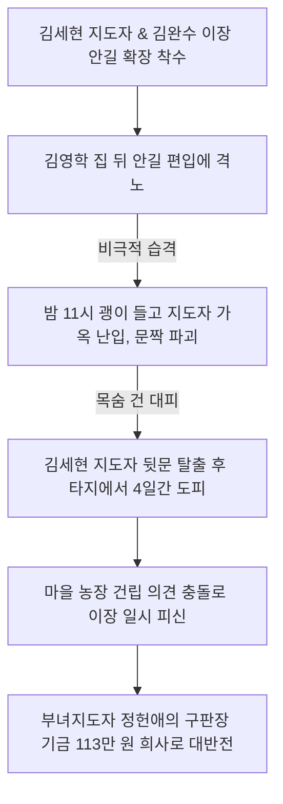

# 충북 옥천군 청산면 상례곡리 — 우암 송시열 선생의 예풍이 깃든 광산 김씨 집성촌, 괭이 습격을 이겨내고 이룩한 2천만 원 최우수 기적

---

## 1. 마을 개황 및 씨족 사회의 완고함과 깊은 빈곤

### 가. 영의정 우암 송시열 선생과 광산 김씨의 은거지
충청북도 옥천군 청산면 상례곡리(상례곡마을)는 조선 시대 영동군, 보은군, 상주군에 귀속되어 오다 1914년 옥천군 북면에 편입되었고, 1951년 청산면 상례곡리로 분리·정착된 유서 깊은 전통 부락이었습니다.

* **500년 선비의 숨결**: 조선 숙종 경신년(1680년), 당시 영의정이었던 **우암 송시열(尤庵 宋時烈)** 선생과 그의 이종사촌인 광산 김씨 **김광로(金光魯)** 선생이 허견의 난(許堅의 亂) 직후 세속을 떠나 이곳으로 낙향하면서 마을의 기틀이 닦였습니다. 오늘날에도 우암 송시열 선생이 직접 쓴 친필 문화재 가옥과 현판이 여러 개 보존되어 있는 유서 깊은 예향(禮鄕)이었습니다.
* **씨족 사회의 완고함**: 총 59호 가구 중 광산 김씨(光山 金씨 - 원안 오타 '광산금씨')가 무려 51호(전체의 90%)를 차지하는 전형적인 단일 씨족 부락이었습니다. 전통 예법에 대한 자부심은 대단했으나, 역설적으로 변화와 개혁을 극도로 꺼리는 고질적인 문중 이기주의와 완고함에 갇혀 있었습니다.

### 나. 썩은 지붕과 하루 한 끼 죽으로 때우던 세월
* **피할 수 없던 보릿고개**: 영세한 밭데기 옥수수와 연초(담배) 재배 1ha가 농업의 전부였습니다. 주민들은 "하루 세끼 중 한 끼는 시래기 죽으로 연명하지 못하는 집이 없었다" 할 정도로 춘궁기마다 굶주림에 허덕였습니다. 
* **썩어가는 초가**: 찢어지게 가난한 탓에 수년 동안 초가지붕 갈이를 한 번도 하지 못해, 썩어가는 볏짚 지붕 위에서는 늘 퀴퀴하고 음습한 악취가 마을 가득 진동하고 있었습니다. 주민들은 장날만 되면 읍내 주막에 널브러져 취한 채 싸우거나 고소 고발을 일삼아, 인근 이웃들로부터 "양지촌 싸움꾼들, 만의실 투전꾼들"이라며 조롱의 대상이 되었습니다.

---

## 2. 괭이를 든 야간 습격과 생사의 도피 투쟁 (1972~1975년)

1972년, 중학교를 졸업하고 고향을 지키던 청년 **김세현(金世賢)**이 새마을지도자로 선출되었고, 뒤이어 서울에서 대학을 졸업하고 대기업 사원으로 근무하던 엘리트 청년 **김완수(金完洙)**가 고향의 낙후성을 타개하기 위해 귀향하여 1975년 12월 이장직을 맡으며 두 젊은 동력이 상례곡리의 전면 개조를 단행했습니다.

### 가. "당장 죽이겠다!" — 김세현 지도자의 목숨을 건 뒷문 탈출
* **안길 확장을 둘러싼 씨족 간의 갈등**: 소형 리어카조차 다닐 수 없던 좁은 골목을 넓히기 위해 안길 확장을 시행하던 도중, 완고한 주민 **김영학**의 집 뒤뜰 땅 일부가 도로에 편입되는 공사가 시작되었습니다. 문중의 경계를 침범당했다며 격노한 김영학은 씻을 수 없는 폭력을 계획했습니다.
* **괭이 야간 가옥 습격**: 그날 밤 11시, 단잠에 빠져 있던 김세현 지도자의 집 마당으로 김영학이 **날카로운 쇠괭이**를 들고 난입했습니다. *"이 새끼 당장 나와 죽여버리겠다!"*라며 폭언을 쏟아 부으며 방 안으로 들어가기 위해 괭이로 안방 나무 문짝을 사정없이 찍어 내렸습니다. 문짝이 박살 나는 아수라장 속에서, 김세현 지도자는 옷도 제대로 입지 못한 채 엉겁결에 안방 뒷문으로 탈출해 어둠 속으로 도망쳤습니다. 그는 분노한 문중 어른들의 눈을 피해 이웃 타처에서 무려 **4일 동안 숨어 지내야만 했던 눈물겨운 대피의 역사**를 겪었습니다.
* **마을 농장 건립을 둘러싼 또 한 번의 좌절**: 훗날 대규모 '공동 농장 조성 사업' 단계에서도 업자와 결탁하여 주민들을 착취한다는 억울한 누명을 쓰고 주민들의 격렬한 탄핵과 비난을 받아, 김완수 이장 역시 신변의 위협을 느끼고 며칠 동안 마을을 완전히 피신해 있어야 하는 수모를 이겨내야 했습니다.

---

## 3. 정헌애 부녀지도자의 '장 안보기 운동'과 113만 원 기적

벼랑 끝에 몰린 청년 지도자들을 구원하고 상례곡리의 단합을 이끌어낸 결정적 주역은 여성 지도자 **정헌애(鄭憲愛)** 부녀회장이었습니다.

* **장 안보기 운동과 절미 저축**: 정헌애 회장은 1972년부터 부녀회를 조직, 가정이 가난한 원인이 사소한 생필품을 사러 읍내 장터에 자주 나가 쓸데없는 돈을 소비하기 때문이라고 분석했습니다. 그녀는 부녀회원들을 설득해 마을에 **공동 구판장(협동 상회)**을 전격 설립하고, 읍내 장터 출입을 원천 차단하는 **'장 안보기 운동'**을 전개했습니다. 매일 밥을 지을 때 쌀 한 숟가락씩 저축하는 '절미저축운동'을 억척스럽게 밀어붙였습니다.
* **공동 기금 113만 원 전액 희사**: 부녀회는 이렇게 피땀 흘려 모은 귀중한 **공동 기금 113만 원 중 60만 원을 마을 전화 개통 사업 내선 공사비로 선뜻 희사**했으며, 간이 상수도 가설 시설에도 **53만 원을 통째로 기부**하여 정체되어 있던 남성 주민들의 이기주의에 거대한 경종을 울리고 새마을 불씨를 다시 지폈습니다.

---

## 4. 상례곡마을 역사적 주민총회 회의록 완벽 복원

상례곡마을의 가난을 뜯어고치기 위해 매일 밤 사랑방에서 벌어졌던, 피 튀기는 주민총회와 난상토론의 역사를 날것 그대로 복원합니다.

### 📄 [회의록 1] 안길 확포장 및 담장 개량 대책 총회
* **일시**: 1971년 12월 15일 (19:30 ~ 21:30)
* **장소**: 김태중의 사랑방
* **의제**: 마을 안길 확장 및 담장 개량 사업 추진의 건
* **참석인원**: 금용복 외 51명 (불참 5명)
* **사회자**: 이장 (금용달)

* **회의 진행 및 대화 내용**:
  * **사회자**: "어르신들, 추운 겨울 밤 날씨에 이렇게 소집을 해서 참 죄송스럽기 짝이 없습니다. 다름이 아니라 나라에서 우리 농촌을 깨끗이 바꾸자는 '새마을 가꾸기 사업'을 장려하고 있습니다. 우리 마을도 명년부터 나라에서 일부 자재를 준다고 하니, 미리 안길을 시원하게 넓히고 썩어가는 담장들을 말끔하게 개량하면 어떨까 상의하고자 모셨습니다."
  * **김봉수**: "(담배 연기를 푹 내뿜으며 버럭 소리를 지른다) 이봐! 이장 사람아! 국가에서 지원을 해주든 말든 우리랑 무슨 상관이란 말인가? 내 논밭 내 담장은 내일 내가 알아서 할 일이지, 이장이 간섭할 일인가? 쓸데없이 남의 집 일 넘보지 말고, 그따위 뚱딴지같은 소리 할라치면 오늘 회의 당장 집어 치우소!"
  * **사회자**: "김 어르신, 노여움을 가라앉히십시오. 우리 상례곡리는 어르신들의 선조와 우암 송시열 선생께서 이미 오래전부터 정착하여 가꾸어오신 자랑스러운 광산 김씨 선비 마을입니다. 또한 우리의 귀중한 자식들과 후손들이 대대손손 영원히 터를 잡고 살아야 할 소중한 고향 아닙니까? 예전의 가난을 물려줄 수는 없습니다."
  * **김봉수**: "듣기 좋은 개소리 마소! 당장 내 집 마당 모퉁이를 깎아 길로 내라는데 어느 미친놈이 좋아라 하겠는가?"
  * **사회자**: "어르신들, 지금 우리 동네는 너무나도 더럽고 지저분합니다. 길바닥을 보십시오. 비만 오면 길인지 하수구인지 돼지우리인지, 사람이 사는 동네인지조차 분간할 수 없을 정도로 엉망진창입니다. 어찌 우리가 조상의 무덤 앞에서 이 비참함을 모른 척하겠습니까? 안길을 곧게 닦는 데는 주민 여러분의 소중한 땅이 필요합니다. 우리의 남은 여생보다 후손에게 떳떳이 물려줄 값진 고향의 길을 닦읍시다. 아낌없는 협조 없이는 도저히 길을 넓힐 수 없습니다."
  * **김용연**: "듣고 보니 참으로 부끄러운 일이구만. 이장 말이 백번 옳소. 이웃 동네에 장 보러 갈 때마다 상례곡 양반놈들 길도 좁아 리어카도 못 끌고 다닌다고 비웃음당하는 것을 평생 참아왔네. 우리 모두 힘을 합쳐 일해 봅시다! 정 길을 넓혀야 한다면 내 밭뗈기 길목부터 제일 먼저 깎아 확장하시오!"
  * **사회자**: "김용연 어르신, 참으로 고맙고 뜨거운 결단이십니다! 주민 여러분의 생각은 어떠십니까?"
  * **주민 일동**: "(서로 눈치를 보다가 고개를 끄덕이며) 어차피 언제고 한 번은 해야 할 일인데, 이왕 나라에서 자재를 준다니 하는 것으로 합시다!"
  * **김용철**: "좋소, 길을 내는 것에 찬성하오. 다만 이장과 개발위원들은 우선 구체적이고 종합적인 안길 설계 계획을 수립하시오. 누구의 집 마당과 밭이 얼마나 편입되는지 투명하게 공개하고, 서면으로 정식 토지 기증 승낙서를 다 받아낸 후에 공사에 착수합시다."
  * **사회자**: "김용철 어르신, 아주 공정하고 훌륭한 고견이십니다. 안길을 확장하는 데 제일 땅이 많이 편입되는 **김재익 씨의 논밭**과 **이성춘 씨의 논** 등 몇몇 분들만 너그럽게 승낙해 주신다면 큰 무리 없이 쉽게 대공사를 완수할 수 있을 것입니다. 수일 내로 상세한 계획서를 수립하고 개인별로 직접 찾아가 엎드려 설명해 드리며 승낙을 받겠습니다. 앞으로 적극적인 협조를 부탁드리며, 명년에는 필히 지원 자재를 가득 타오겠습니다. 오늘 회의는 이것으로 마칩니다. 조심히 돌아가십시오."

---

### 📄 [회의록 2] 상례곡마을 역사적 새마을지도자 선출 총회
* **일시**: 1972년 1월 10일 (19:30 ~ 21:30)
* **장소**: 김태중의 사랑방
* **의제**: 상례곡마을 공식 새마을지도자 선출의 건
* **참석인원**: 금용복 외 52명 (불참 5명)
* **사회자**: 이장 (금용달)

* **회의 진행 및 대화 내용**:
  * **사회자**: "오늘도 고된 겨울철 농가 부업으로 지치셨을 텐데, 늦은 시간에 한 분도 빠짐없이 모여 주셔서 진심으로 감사드립니다. 오늘 모인 이유는 다름이 아니라, 정부에서 올해부터 공식적으로 추진하는 새마을 가꾸기 사업을 우리 마을에서 밤낮으로 헌신하며 진두지휘할 **'새마을지도자'**를 한 분 선출하고자 합니다. 마을의 미래가 걸린 선거인 만큼, 누구를 선출하면 좋을지 기탄없이 추천해 주시기 바랍니다."
  * **임세현**: "지도자를 선출하는 중차대한 일을 그저 목소리 큰 사람 말 한마디로 결정할 수는 없습니다. 몇 분의 유능한 청년 후보를 추천받아 투표용지에 직접 이름을 적어 내는 비밀 기명 투표로 정하는 편이 깨끗하고 깔끔하지 않겠습니까?"
  * **주민 일동**: "좋소! 추천 후 기명 투표로 확실하게 결정합시다!"
  * **사회자**: "그럼 대상자 추천을 받겠습니다."
  * **김재익**: "성품이 곧고 마을 일에 늘 앞장서는 중졸 청년 **김세현 씨**를 지도자로 추천합니다."
  * **김영억**: "젊고 패기 넘치는 **김인수 씨**를 적극 추천합니다."
  * **사회자**: "또 추천하실 분 계십니까?"
  * **김명복**: "마을 대소사에 늘 궂은일을 도맡아 하던 **김용복 씨**를 추천합니다."
  * **사회자**: "또 다른 추천 대상자가 없으시면, 추천된 세 분 후보(김세현, 김인수, 김용복)를 두고 기명 투표를 시작하겠습니다. 나누어 드린 백지에 원하시는 분의 이름을 한 명씩 기재해 주십시오."
  * *(잠시 긴장된 침묵 속에서 기명 투표가 진행되고 투표지 52매가 일괄 회수되었다)*
  * **사회자**: "투표 결과를 발표하겠습니다. 기권 없이 52표 전원 유효표입니다. **김세현 씨 37표, 김인수 씨 13표, 김용복 씨 3표**를 얻었습니다. 이로써 압도적인 표를 얻은 김세현 씨가 상례곡리 초대 새마을지도자로 당선되었습니다! (사랑방이 떠나가라 우레와 같은 주민들의 격려 박수가 쏟아졌다) 당선된 김세현 지도자의 각오 한마디를 듣겠습니다."
  * **김세현**: "(당황스러워하며 고개를 숙이다가 굳은 어조로 일어선다) 참으로 부족하고 아무것도 모르는 저에게 새마을지도자라는 상례곡리의 운명이 걸린 무겁고 영광스러운 직책을 맡겨 주셔서 송구스럽고 감사할 따름입니다. 일신우일신하여 저의 온 육체와 열정을 다 바칠 것을 선조들의 위패 앞에 맹세합니다. 주민 여러분, 부디 저의 든든한 동반자가 되어 주십시오. 적극적인 협조를 간곡히 부탁드립니다! 감사합니다!"
  * **사회자**: "우리의 새마을 사령탑이 훌륭하게 세워졌습니다. 오늘 회의는 기쁜 마음으로 폐회합니다. 편안한 밤 되십시오."

---

### 📄 [회의록 3] 국가지원 시멘트 400포대 및 철근 1톤 배분 총회
* **일시**: 1972년 11월 20일 (19:30 ~ 21:00)
* **장소**: 김태중의 사랑방
* **의제**: 정부 지원 시멘트 400포대, 철근 1톤의 효율적인 활용 및 사업 계획 수립의 건
* **참석인원**: 주민 58명 참석
* **사회자**: 이장 (금용달)

* **회의 진행 및 대화 내용**:
  * **사회자**: "주민 여러분, 축하해 주십시오! 우리 김세현 지도자와 주민 여러분이 작년 겨울부터 피땀 흘려 안길 확장의 토대를 닦아놓은 자조적 성과를 인정받아, 이번에 군청으로부터 **시멘트 400포대와 철근 1톤을 무상 전격 지원**받게 되었습니다! 군수님과 면장님께 감사를 올려야 할 경사입니다. 이 귀중한 관급 자재를 어떤 숙원 사업에 집중 투입하면 좋을지 지혜를 모아 주십시오."
  * **지도자 (김세현)**: "작년 한 해 우리는 안길 확장과 일부 불량 담장을 개량했습니다. 하지만 솔직히 공사 구간만 사방에 넓혀놓았을 뿐, 마무리가 제대로 되지 않아 여전히 미진한 곳이 많습니다. 명년에 자재가 정식 입고되는 대로, 저는 우선 이 미완성 공사 구간의 뒤처리를 말끔히 끝내고, 남은 자재로 비만 오면 무너지는 농로 배수 하수구와 돌바닥 소교량 시설을 전격 가설했으면 하는데 주민 여러분의 뜻은 어떠십니까?"
  * **김재익**: "지도자님의 말씀도 좋으나, 당장 우리 마을 앞은 여름철 장마나 조금의 홍수만 나도 개울물이 넘쳐나 어린 초등생들이 통학을 아예 못 하고 징검다리 앞에서 쩔쩔매고 웁니다. 이 서러움을 해결하기 위해서라도 이번 시멘트와 철근으로 마을 앞을 가로지르는 **튼튼한 콘크리트 소교량(다리) 가설 사업**을 우선으로 해 주십시오."
  * **김명수**: "다리나 하수구도 좋지만, 가난하게 사는 주민 처지에 언제 시멘트를 구경해 보겠소? 차라리 지원받은 시멘트를 집집마다 4~5포대씩 골고루 나누어 주어, 각자 자기 집 무너져가는 돌담이나 마당 바닥을 시멘트로 공평하게 때울 수 있도록 현물 분배해 주시오!"
  * **사회자**: "김명수 씨, 그건 큰일 날 말씀이십니다! 국가에서 무상 지원하는 새마을 시멘트는 오직 공익을 위한 공동 공공사업에만 사용하도록 엄격하게 규정되어 있습니다. 사리사욕을 위해 개인 집 앞마당 개량에 한 포대라도 몰래 썼다가는 전량 회수당하고 이장과 지도자가 처벌을 받게 되니 절대 불가함을 양지해 주시기 바랍니다. 다른 공익적인 고견을 내주십시오."
  * **김용현**: "그렇다면 사적인 분배는 불가하니, 김세현 지도자께서 제안하신 대로 미완성된 안길 확장 마무리와 하수구 배수로 정비, 소교량 가설에 일괄 투입하는 것이 우리 마을이 한 단계 더 영광스럽게 발전하는 최고의 길이라 생각합니다!"
  * **이장원**: "저 역시 지도자의 철저하고 공정한 제안에 전적으로 동의합니다!"
  * **사회자**: "다른 훌륭한 고견이 더 없으시다면, 두 가지 채택 안건을 두고 가부를 거수 결정하겠습니다. 지도자가 제안한 종합 안길 정비 및 하수 배수로 사업에 동의하시는 분은 힘차게 손을 들어 주십시오!"
  * *(참석 주민 58명 중 53명이 우렁찬 동의와 함께 거수하였다)*
  * **사회자**: "압도적인 53명의 찬성으로 지도자의 정식 사업 계획을 전격 채택하겠습니다. 그렇다면 명년 새마을 사업은 **안길 확장 1개소, 배수 암거 4개소, 마을 소교량 1개소 가설**로 결의하고, 작업 일동은 반별로 공평하게 날짜를 짜는 반별 윤번제 공동 노역으로 고되게 밀어붙이겠습니다. 감사합니다. 오늘 회의는 이상으로 폐회합니다."

---

### 📄 [회의록 4] 눈물의 마을회관 착공 결의 총회
* **일시**: 1974년 11월 25일 (19:30 ~ 21:00)
* **장소**: 김용복의 집 사랑방
* **의제**: 1975년도 상례곡마을 자력 공동회관 건립의 건
* **참석인원**: 금세현 외 47명 (불참 10명)
* **사회자**: 이장 (금용호)

* **회의 진행 및 대화 내용**:
  * **사회자**: "사랑하는 상례곡리 주민 여러분, 명년에는 우리 동민 전체가 보란 듯이 더 큰 희망을 품고 잘 사는 마을을 만들어 가야 합니다. 그러기 위해서는 너 나 할 것 없이 올 가을보다 몇 배는 더 억척스럽게 분발하여 새해 새마을 사업을 추진해야 합니다. 먼저 명년에 도내 자립 부락 승격을 위해 어떤 사업을 해결하면 좋을지 자유롭게 안을 내주십시오."
  * **지도자 (김세현)**: "어르신들, 현재 우리 마을에는 면 단위나 군 단위 사업을 구상하거나 주민들이 모여 따뜻하게 회의할 수 있는 번듯한 회당(공동 집회실)이 단 한 칸도 없습니다. 매번 남의 집 사랑방 신세를 지며 눈치를 보는 비참한 형편입니다. 마침 나라에서 새마을 시멘트 350포와 자재 보조금 9만 원을 특별 지원해 준다고 하니, 여기에 우리가 피땀 흘려 모은 부녀회 구판 수익과 마을 기금 30만 원을 매칭해 **우리 상례곡리의 백년대계가 될 '자력 공동 마을회관'을 전격 착공**하면 어떻겠습니까?"
  * **사회자**: "참으로 눈물이 날 정도로 훌륭한 구상입니다. 회당이 없어 길가 마당에서 추위에 떨며 총회를 하던 서러움을 끝내야 합니다. 마음 놓고 교육받고 좌담을 나눌 우리들의 전당이 절실합니다. 지도자의 회관 건립 안건에 이의가 있으신 분은 말씀하십시오."
  * **주민 일동**: "(일제히 박수를 치며) 찬성이오! 남의 집 사랑방 눈치 보던 세월을 청산하고, 우리 손으로 보란 듯이 번듯한 기와지붕 회관을 올려 봅시다!"
  * **사회자**: "만장일치 대결단에 깊이 감사드립니다. 상례곡리의 공동 마을회관 건립을 확정 짓고, 내일 새벽부터 온 주민이 직접 회관 기초 터파기 공동 노역에 돌입하겠습니다. 이상으로 회의를 마칩니다. 감사합니다!"

---

## 5. 김덕중 조합장의 전 재산 담보 신화와 2,000만 원 대상 준공 (1977년)

* **[👨‍💼 미담] 김덕중 조합장의 개인 재산 담보 대출**: 1977년 2월 10일, 상례곡리가 추진하던 핵심 특화 영농인 **'공동 농장 조성 사업'**이 자금 고갈로 자재 수급이 막혀 전면 중단될 난관에 봉착했습니다. 이때 이 마을 출신이자 청산단위농협 조합장이었던 **김덕중(金德重)**은 후배들의 뜨거운 구향 정신에 감복하여, **자신의 개인 사재 전체를 농협에 담보로 기꺼이 잡히고 3,000,000원이라는 거액을 무상 대여**해 주어 자금난을 단숨에 해결해 주었습니다.

### 🏢 상례곡마을 공동 현대화 인프라 구축 실적 (1972~1977년)

| 연도 | 주요 추진 새마을 사업 내용 | 확보된 소득 및 문화 자산 |
| :--- | :--- | :--- |
| **1972~1973년** | • 주민 숙원 새마을 마을회관 신축 착공 • 마을 중심 안길 확포장 (580m) | • 부녀 구판 기금 28만 원 조기 달성 |
| **1975~1976년** | • 썩은 초가지붕 슬레이트 전면 교량 개량 완료 • 마을 전 가구 전화 가설 내선 공사 완료 (부녀회 60만 원 지원) | • 간이 급수수도 보급 (부녀회 53만 원 지원) |
| **1977년** | • 대단위 공동 농장 및 원예 온실 축조 완공 • 행정실적 최우수 상업 도지사 표창 수상 | • **대통령 전격 최우수 부락 상금 2,000만 원 수령** |

> [!IMPORTANT]
> 괭이를 든 폭력 습격과 문중의 지독한 반대라는 모진 시련 속에서도, 김세현 지도자의 헌신과 정헌애 부녀회장의 113만 원 절미 희사, 김덕중 조합장의 전 재산 담보 기적을 통해 상례곡리는 **1977년 내무부 장관 선정 대한민국 최우수 부락 상금 2,000만 원**이라는 불멸의 대기록을 수립하며 전국 최고의 명품 시범 부락으로 우뚝 섰습니다.

---
*(출처: 영광의 발자취 - 마을 단위 새마을운동 추진사 제1집)*
