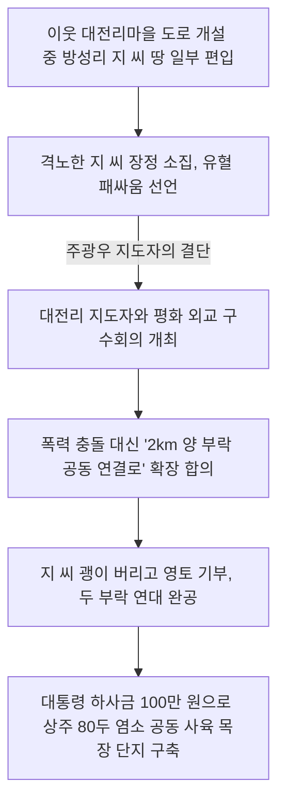

# 충북 괴산군 문광면 방성리 — 패싸움 위기를 극복한 2km 공동 연대 도로, 80두 상주 염소 목장 단지와 산골짜기의 기적

---

## 1. 마을 개황 및 험준한 산간 협곡의 격리된 세월

### 가. 사방이 꽉 막힌 기형적 산골짜기, 방성골
충청북도 괴산군 문광면 방성리(방성골마을)는 사방이 가파른 바위산과 험준한 협곡으로 둘러싸여 소구루마조차 진입하기 어려웠던 기형적인 산간벽지였습니다.

* **숙명적 가난과 나태**: 경작할 수 있는 좁고 척박한 비탈밭이 농업 영농의 전부였기에 소득수준은 괴산군 관내에서 가장 영세한 수준이었습니다. 척박한 수확량으로 매년 봄철 보릿고개를 넘기지 못해 칡뿌리를 캐 먹으며 연명했습니다. 주민들은 발전하겠다는 의지조차 없이, 매일 사랑방에 옹기종기 모여 앉아 화투 노름판을 벌이며 외상술과 불평불만으로 소일했습니다.
* **기괴했던 가옥 형태**: 고랑이 파이고 무너져가는 썩은 초가지붕 아래, 비료 포대를 문종이 삼아 바른 가마니 문틈으로 칼바람이 들이쳤습니다. 전기가 가설되지 않아 호롱불 밑에서 문명세계와 완벽히 격리된 비참하고 부끄러운 원시 형태의 삶을 대대로 숙명처럼 영위하고 있었습니다.

---

## 2. 유혈 패싸움 위기를 '2km 공동 신작로 연대'로 바꾼 기적 (1971년)

1971년, 무지와 방탕에 젖어 있던 방성골에 고등학교를 졸업하고 부모의 농사일을 돕던 청년 **주광우(朱光宇)**가 주민들의 완강한 무관심을 이겨내고 새마을지도자를 자원하고 나서면서 천지개벽의 서막이 열렸습니다.

### 가. 이웃 대전리마을과의 영토 분쟁과 결투 위기
* **지씨 문중의 결사반대**: 이웃 청천면 대전리마을이 새마을 농로를 축조하던 도중, 방성리의 완고한 주민 **지(池) 씨** 가문의 개인 땅 일부가 도로 경계선에 편입되었습니다. 지 씨는 이웃 동네 놈들이 감히 조상 대대의 땅을 빼앗아 가려 한다며 분노를 참지 못했습니다. *"내일 온 집안 문중 장정들을 몽땅 대동하고 들판으로 나가 괭이와 낫을 들고 대전리 놈들과 패싸움이라도 해서 사생결단을 내겠다"*라며 칼을 갈았습니다. 방성리의 과격한 청년들 역시 지 씨 가문의 격양에 합세하여 대규모 문중 유혈 충돌(패싸움)이 일보 직전에 달했습니다.

### 나. 칼을 버리고 삽을 들게 한 주광우 지도자의 외교 전략
주광우 지도자는 이 피비린내 나는 폭력 충돌을 평화적으로 해결하기 위해 홀홀단신 대전리마을의 새마을지도자를 찾아가 구수회의를 제안했습니다.
* **역발상 연대 타결**: 주광우 지도자는 *"양 마을이 경계를 두고 싸울 것이 아니라, 이 다툼을 계기로 두 마을을 시원하게 연결하는 **총연장 2km의 공동 진입 안길 개설 사업**으로 공동 격상시키자"*라고 전격 제안했습니다. 
* **공동의 결실**: 이 위대한 외교적 타결에 감동한 지 씨는 결투 몽둥이를 버리고 자신의 토지를 기꺼이 기부했습니다. 양 마을 청년들은 서로 멱살을 잡던 손으로 괭이를 잡고 힘을 합쳐 산벽을 깎아 나갔습니다. 마침내 두 마을을 넓게 가로지르는 2km의 평화적인 교통로가 기적적으로 뚫려, 지게의 고된 수고로움을 덜고 경운기가 시원하게 왕래하는 영광의 탄탄대로가 완성되었습니다.

---

## 3. 방성마을 역사적 주민총회 회의록 완벽 복원

가장 가난한 산골짜기 방성골 주민들이 지게를 벗어 던지고, 썩은 초가를 허물며, 흑염소 대단위 부락 목장을 일궈내기까지의 날것 그대로의 치열한 주민총회를 복원합니다.

### 📄 [회의록 1] 보릿고개 고립 타파를 위한 3km 농로개설 총회
* **일시**: 1972년 11월 12일 (19:30 ~ 21:30)
* **장소**: 마을 구판장 사랑방
* **의제**: 마을 진입 농로 개설 및 노선 설정의 건
* **참석인원**: 마을 개발위원 및 주민 전원 참석
* **사회자**: 개발위원장 (지장훈)

* **회의 진행 및 대화 내용**:
  * **사회자**: "오늘 추운 초겨울 날씨에 주민 여러분을 이렇게 모시게 된 이유는, 명년도 73년도 새마을 사업으로 우리 마을의 가장 큰 설움인 '진입로 신작로 개설'에 대해 의견을 좁히고자 함입니다. 먼저 진입로를 몇 개소로 닦고, 길이를 어디부터 어디까지 하면 좋을지 자유롭게 말씀해 주십시오."
  * **이재우**: "답답해서 제가 먼저 입을 떼겠습니다! 우선 아래 갈골(아랫여생이)에서부터 위 방성골(위여생이)까지 이어지는 큰길을 직선으로 시원하게 뚫어야 되겠습니다. 거리를 일직선으로 곧게 잡으면 약 2km 정도 안 나오겠습니까? 여태껏 우리 조상대대로 4km가 넘는 험악한 고갯길을 무거운 땔감과 벼가마니를 오직 지게로만 져서 고되게 날랐으니, 이제 이 지긋지긋한 지게질 좀 그만 탈피해야 되지 않겠습니까? 제 생각은 이렇습니다!"
  * **지장훈**: "참말로 귀가 번쩍 뜨이는 훌륭한 고견입니다! 저 역시 이재우 씨 생각에 크게 찬성하는 바입니다."
  * **주민 A**: "갈골하고 방성골 두 군데 다 한꺼번에 닦는 것은 무리요! 힘이 달려 안 되오!"
  * **이재우**: "그럼 우선 갈골 아래 여생이부터 신작로를 내고, 나중에 힘을 모아 방성골 위 여생이를 전격 합치면 되지 않겠소?"
  * **사회자**: "(책상을 치며) 자자, 조용히들 하시고 가만히 계셔 보십시오! 싸우지 말고 우선 진입로 노선을 몇 군데로 뚫을 것인가 개소부터 전격 결정합시다."
  * **주민 일동**: "좋소! 아래 갈골과 위 방성골 두 군데 노선을 동시에 터서 넓히는 방향으로 합시다!"
  * **사회자**: "더 이상 이견이 없으시면 찬성하시는 분들은 힘차게 우레와 같은 박수로 동의해 주십시오!"
  * *(사랑방이 떠나가라 일제히 우레와 같은 손뼉 소리가 쏟아졌다. 서너 명이 팔짱을 낀 채 가만히 서 있었다)*
  * **사회자**: "비록 박수를 안 치신 분들이 서너 분 계십니다만, 참석자 과반수 이상의 절대 찬성으로 **마을 진입 신작로는 총 2개소 노선에 총연장 3km**를 닦는 것으로 정식 결정하겠습니다!"
  * **지장훈**: "길이 결정되었으면 이제 가장 중요한 문제가 있소. 길목에 편입될 땅 지주들인데, 땅 지주들이 몇 평씩 고향을 위해 무상으로 토지를 기증(희사)해야 하지 않겠소?"
  * **이재우**: "그렇게 땅을 다 기부받기는 힘들 겁니다. 부락에 공동 기금이나 돈이 한 푼도 없는데, 그렇다고 우리가 돈을 주고 개인 땅을 살 수도 없는 노릇 아닙니까? 참으로 난감한 문제입니다."
  * **지장훈**: "땅이 수백 평 넘게 깎여 들어가는 사람이 있는가 하면, 길가에 붙어 고작 한두 평만 들어가는 사람도 있으니 이건 불공평하오. 나중에 지주들끼리 싸움 나기 십상이오!"
  * **사회자**: "주민 여러분, 우리는 한 조상의 피를 나눈 이웃입니다. 이 소중한 신작로가 뚫려야만 우리 자식들이 지게를 지지 않고 경운기를 몰아 부자가 될 수 있습니다. 땅이 많이 편입되어 큰 피해를 보는 김영환 씨와 이중일 씨 등 몇몇 분들께는 우리 개발위원회와 이장이 찾아가 다른 비탈밭을 서로 교환해 주거나 마을 기금으로 훗날 보전해 주는 등 가슴 아픈 대안을 반드시 마련하겠습니다. 고향의 백년대계를 위해 넓은 아량으로 기꺼이 토지를 희사해 주시길 부탁드립니다. 만장일치 통과를 정식 선포합니다!"

---

### 📄 [회의록 2] 썩은 초가 타파 지붕개량 사투 총회
* **일시**: 1974년 3월 15일 (20:00 ~ 22:00)
* **장소**: 마을 공동 구판장 강당
* **의제**: 마을 초가지붕 슬레이트 전면 개량의 건
* **참석인원**: 이종원 외 23명 불참, 주민 50여 명 참석
* **사회자**: 새마을지도자 (주광우 / 박광우)

* **회의 진행 및 대화 내용**:
  * **지도자 (박광우)**: "주민 여러분, 지금 이웃 동네인 청천면 장터나 다른 부락에 나가 보십시오. 썩어가는 초가집 지붕이라는 게 별로 눈에 띄지 않을 정도로 온 세상이 번듯하게 변하고 있습니다. 매년 썩어 무너지는 볏짚 지붕은 우리 식구들 위생 건강에도 극도로 나쁠 뿐 아니라, 해마다 이엉을 이을 볏짚이 모자라 쩔쩔매고 고생하지 않습니까? 나라에서 특별히 융자해 주겠다는 새마을 스레트(슬레이트) 자재를 마다하고, 구차하게 매년 이엉을 얹어 이으려 고집부리는 것은 제 생각으로는 참으로 크게 잘못된 나태한 생각입니다!"
  * **주민 B**: "스레트가 좋은 줄은 누가 모르나? 당장 지붕 얹을 목재 한 개 살 돈도 없는 가난한 집더러 어쩌란 말이오?"
  * **사회자**: "걱정하지 마십시오. 스레트 자금 조달에 관한 까다로운 행정 사무처리는 저와 지도자가 목숨을 걸고 면사무소와 농협을 뛰어다니며 알선해 드리고 적극 도울 것입니다."
  * **지도자 (박광우)**: "맞습니다! 지붕 개량을 내일부터라도 당장 추진하겠다는 분이 단 한 분이라도 계신다면, 저 지도자 박광우가 발 벗고 나서서 무슨 일이든 적극 도울 것을 약속드립니다!"
  * **이재우**: "이건 개인이 할 일이 아니라, 우리 부락 청년회와 주민 전체가 다 함께 하루에 다섯 집씩 공동으로 품앗이 일을 해나가는 공동 노역 방식으로 일괄 해결하는 게 수월할 것 같소."
  * **사회자**: "주민 여러분의 뜻이 하나로 모아졌습니다. 그렇다면 제가 내일 당장 청안단위농협으로 뛰어가 트럭을 섭외하고 스레트 한 차를 가득 신청하여 수일 내로 실어 오겠습니다!"
  * **지장훈**: "(구석에 앉아 고개를 푹 숙인 청년을 툭 치며) 야 임마! 동네서 다 같이 새마을로 바꾸는 좋은 일인데, 하면 자네 집도 당연히 같이 헐고 동참해야지 왜 가만히 눈치만 보고 있나?"
  * **사회자**: "다만 꼭 아셔야 할 규칙이 있습니다. 본인이 직접 썩은 지붕을 말끔히 개량해 놓은 결과가 준공되어 보고되어야만 정부의 저리 융자금과 무상 보조금이 농협에서 즉시 나옵니다. 그러니 최소한의 자체 종잣돈은 각자 수단껏 일시적으로라도 융통해 놓으셔야 합니다."
  * **사회자**: "그리고 스레트를 싣고 들어오는 농협 야간 트럭 편에, 새 지붕 뼈대를 만들 규격 각구목(목재)도 도매가로 함께 실어 와서, 내일부터 **하루에 무조건 5동씩 초가를 헐고 개량**하는 스파르타식 공동 작업을 시행하면 어떻겠습니까?"
  * **지도자 (박광우)**: "(흥분하며 일어선다) 어허! 이렇게 주민 여러분과 머리를 맞대고 침을 튀기며 상의를 하니, 회의석상 안에서 벌써 썩은 우리 방성골 초가집들이 은빛 슬레이트 명품 주택으로 다 바뀐 것 같아 가슴이 터질 듯합니다! 주민 여러분, 결코 우리의 이 뜨거운 각오와 동심이 훗날 변해서는 안 됩니다. 저희 집부터 솔선수범하겠습니다! 내일 아침 동이 트는 대로 당장 저희 집 초가지붕부터 제 손으로 사정없이 걷어내 버릴 테니, 1반 주민 여러분께서는 아침 일찍 지게와 사다리를 메고 저희 마당으로 다 같이 모여 지원해 주십시오!"
  * **주민 일동**: "(사랑방이 무너져라 손뼉을 치며 찬성했다)"

---

### 📄 [회의록 3] 대통령 하사금 100만 원 및 '80두 상주 흑염소 단지' 총회
* **일시**: 1977년 11월 16일 (19:30 ~ 21:00)
* **장소**: 완공된 방성리 마을회관 2층 강당
* **참석인원**: 이성주 외 52명 (불참 24명)
* **사회자**: 새마을지도자 (주광우)

* **회의 진행 및 대화 내용**:
  * **이재우**: "(강당 앞에 붙은 지출 영수증 명세를 보며 장부를 뒤적거린다) 지도자님, 이번 마을회관 보수 자재 물품 구입비 지출 내역에서 공동 퇴비 증산용 지게 자금 경비 처리는 어떻게 된 것입니까? 세부적인 영수증도 다 첨부되어 보관 중입니까?"
  * **개발위원**: "네, 이재우 씨. 여기 박광우, 민옥선, 김옥선, 이중일, 이명중, 이배중, 윤석채 등 개발위원 서명 날인과 함께 단돈 10원짜리 시멘트 대금 영수증까지 완벽하게 철해 두었으니 언제든 투명하게 확인하십시오."
  * **사회자**: "주민 여러분, 안심하시고 의제에 집중해 주십시오. 오늘 모인 핵심 이유는 우리 방성골이 올해 우수 부락으로 선정되어 받은 **'대통령 하사금 100만 원'**을 어떻게 소득과 직결시킬 것인가 결정하기 위함입니다. 저는 이 돈에 우리 공동 기금 20만 원을 보태어 총 120만 원의 종잣돈으로 산비탈 목초지를 활용할 대단위 **'공동 염소 사육 단지'**를 일구었으면 합니다. 제 구상은 경북 상주 산지에 염소가 대량 매물로 싸게 나와 있으니, 상주에 가서 건강한 염소 한 마리당 15,000원씩 총 80두를 일괄 일시 구입하여 방성골로 대량 수송해 올 계획입니다."
  * **지장훈**: "기가 막힌 구상입니다! 척박한 비탈 밭뗈기밖에 없는 우리 산골 지형에는 흑염소 사육만큼 적합하고 떼돈 벌 수 있는 소득 영농이 없다고 늘 얘기들 해오지 않았습니까. 저는 무조건 대찬성입니다!"
  * **사회자**: "흑염소 80마리가 마을로 수송되어 오면, 사육 능력이 있는 60여 가구에 기본 호당 1두씩을 무상 사육 배당하고, 청년 일손이 많고 기르는 솜씨가 정교한 우수 농가에는 특별히 2~3두씩을 임대 배당하여 사육 규모를 곱절로 키우겠습니다. 훗날 염소 새끼를 낳아 내다 파는 이윤 배분 관계는 주민 여러분의 의사를 철저히 수렴해 공정하게 결정하겠습니다."
  * **지장훈**: "동의하오! 이윤 분배는 우리 새마을 지도자와 이장, 그리고 개발위원회가 결코 주민에게 단 한 푼이라도 손해가 가도록 처리하지 않을 터이니, 세부 배분 비율은 개발위원회에 전권 위임합시다! 오늘 낮에 고된 돌 운반 작업을 하느라 온몸이 쑤시고 고단한데, 이 위대한 대결단을 내린 것으로 회의를 말끔히 매듭짓고 이만 뜨끈한 안방으로 헤어지는 게 어떻겠소?"
  * **주민 일동**: "좋소! 지도자의 안대로 염소 단지를 전격 조성합시다! 폐회를 재청합니다!"
  * **사회자**: "만장일치 동의에 깊이 감사드립니다. 상례곡 방성골의 전천후 염소 단지 조성을 선포하며, 오늘 회의를 마칩니다. 수고하셨습니다!"

---

## 4. 70년대 말 종합 현대 인프라 실적 및 80년대 이상촌 도정

방성리 주민들은 염소 목장의 성공과 함께 1977년 한 해 동안 수백 년 묵은 주거 환경을 전면적으로 혁신했습니다.

* **재래식 축사 개량**: 1977년 봄, 가축 전염병을 원천 차단하기 위해 **30가구의 노후된 재래식 가축 축사를 완전히 철거하고 규격 콘크리트 현대식 축사로 개축** 완료했습니다.
* **전 가구 체신 전화 개통**: 1974년 정부 지원 소교량 4개소(24m) 축조 성공과 함께, **50호 전 가구에 체신 전화를 조기 개통**하여 산골짜기 안에서 청주시와 괴산군청 행정망을 실시간으로 주고받는 광명의 전천후 통신망을 구축했습니다.

### 🏢 방성마을 연도별 새마을 대도약 종합 실적

| 구분 | 주요 개발 사업 성과 내용 | 총사업 비용 (원) | 실질적인 복지 및 문명 성과 |
| :--- | :--- | :---: | :--- |
| **1972~1973년** | • 양 부락 연대 2km 신작로 준공 • 30평형 아담한 시멘트조 공동 창고 가설 | **1,500,000** | 지게 퇴치 및 경운기 교통망 연결 |
| **1974년** | • 50가구 전 전용 체신 전화 일제 개통 • 소류지 농업용수 보수 석축 (13m) 가설 | **2,680,000** | 고립 탈피 실시간 원거리 통신 정립 |
| **1977년** | • 노후 불량 재래식 가축 축사 개축 (30가구) • 2개소 대형 농로 개설 (2,500m) | **6,500,000** | 위생 가축 단지 및 농업 기계화 고도화 |

> [!IMPORTANT]
> 경계를 침범당했다며 괭이를 들고 피비린내 사는 폭력 결투를 선언했던 이웃 부락과의 대위기를 주광우 지도자의 위대한 평화 외교와 **'2km 양 부락 연결 신작로 개설'**로 슬기롭게 승화시키고, 경북 상주산 흑염소 80두 사육 목장 신화를 이룩한 괴산 방성리는 **1978년 대망의 정부 공식 '자립마을'로 등극**하는 기적을 완성했습니다.

---
*(출처: 영광의 발자취 - 마을 단위 새마을운동 추진사 제1집)*
