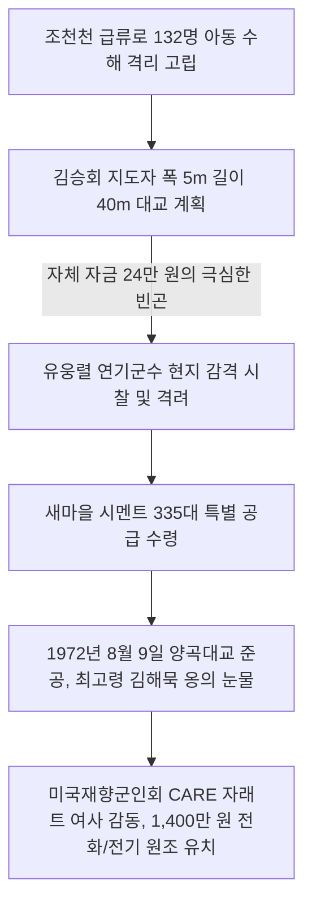

# 충남 연기군 전동면 양곡리 — 조천천 40미터 자력 대교 가설과 CARE 미국재향군인회 자래트 여사의 1,400만 원 원조 신화, 청년 지도자의 청춘을 불사른 자립촌

---

## 1. 마을 개황 및 문명에서 격리된 양지촌의 한

### 가. 조천천의 세찬 급류에 가로막힌 '양지촌'과 '만의실'
충청남도 연기군 전동면 양곡리(양촌마을)는 사방이 가파른 산자락에 둘러싸인 아늑한 지형이면서도, 마을 앞을 가로지르는 넓은 **조천천(鳥川川)**의 거센 급류에 평생 고립되어 살아가던 벽지였습니다.

* **고질적인 고립과 설움**: 작은 비만 내려도 조천천의 물이 급격히 불어났습니다. 66세대 주민들과 어린 초등학생 132명은 폭우가 쏟아질 때마다 위험천만한 외나무다리를 건너야 했고, 강물이 넘칠 때는 등교도, 장터 출입도 완전히 단절된 채 가위눌려 살아가야 했습니다.
* **가난과 술주정으로 얼룩진 세월**: 비옥한 전답이 없어 산비탈 소작농이 대부분이었고, 농한기만 되면 주민들은 주막에 모여 허무한 도박과 난잡한 술주정으로 소일했습니다. 이웃 마을로부터 "만의실 거지 소굴, 양지촌 주정뱅이놈들"이라며 비아냥을 들었고, 마을 지도자가 되려는 인재도 전혀 없어 미래에 대한 개척정신이라고는 단 한 줌도 찾아볼 수 없던 슬픈 부락이었습니다.

---

## 2. 6만 원으로 시작한 '조천천 40m 자력 대교' 개척의 기적 (1972년)

천안농업고등학교를 우수한 성적으로 졸업하고, 부모의 유지를 받들어 대기업 유혹을 뿌리치고 농업에 전념하던 청년 **김승회(金勝會)**가 1966년 3월, 20대의 젊은 나이에 이장으로 선임되었습니다. 그는 이장 5년, 새마을지도자 7년 등 **총 12년 동안 청춘을 통째로 불사르며** 고향 복흥에 일생을 바쳤습니다.

### 가. 60만 원 예산으로 도전한 300만 원 공사
김 지도자는 고립의 사슬을 끊기 위해 조천천을 가로지르는 폭 5m, 길이 40m의 웅장한 콘크리트 대교 가설을 선언했습니다.
* **불신하는 주민들**: 총공사비가 무려 300만 원 이상 소요되는 대형 토목 사업인데, 당시 마을 수중의 공동 기금은 고작 **60만 원(실부담 24만 원, 미정 30만 원)**에 불과했습니다. 주민들은 *"어린 이장 놈이 노름판 주막 돈만 날리고 미쳐 날뛴다"*라며 동참을 거부하고 주막에서 코방귀를 뀌었습니다.

### 나. 유웅렬 군수의 감격과 335대 시멘트 조달
* **어린 이장의 눈물겨운 도전**: 김 지도자는 교량을 포기할 수 없어 서울의 재경 인사들을 일일이 찾아가 바짓가랑이를 붙잡고 기부 협조를 애원했고, 마침내 이 뜨거운 자조 협동의 정신을 들은 **유웅렬 연기군수**가 직접 양곡리 조천천 현장을 전격 방문했습니다. 
* **군수의 아낌없는 지원**: 유 군수는 가난한 어린 이장의 눈물겨운 설계 도면을 보며 크게 탄복하고 그의 어깨를 두드렸습니다. *"금(김) 이장, 참으로 위대한 청년이요! 어린 청년의 담대한 애향 신념을 내 어찌 모른 척하겠소. 내 권한을 총동원해 도울 테니 당장 착공해 보시오!"*라며 격려하고, 당시 국가 비축 자재였던 **새마을 시멘트 335대를 전격 하사**하여 대교 건설의 역사적인 첫 삽을 뜨게 했습니다.

---

## 3. 양곡마을 역사적 주민총회 회의록 완벽 복원

가난에 찌든 양촌마을을 개조하고, 조천천 대교를 가설하며, 미국 구호단체 CARE의 자금 원조를 따내기까지 밤새워 격론을 벌였던 회의록을 생생한 사투리와 눈물의 문체로 복원합니다.

### 📄 [회의록 1] 마을 안길 확장과 김명기 퇴비장 이전 담판 총회
* **일시**: 1971년 10월 15일 (20:00 ~ 22:30)
* **장소**: 김승회 이장 집 사랑방
* **의제**: 마을 안길 확장 및 정부 양곡 공판장/창고 건립 부지 협의의 건
* **참석인원**: 임한복 외 45명 참석
* **사회자**: 이장 (김승회)

* **회의 진행 및 대화 내용**:
  * **사회자**: "바쁜 가을철 농번기 일과를 마감하고 온몸이 노곤하실 텐데, 밤늦게 회의를 소집해서 참으로 죄송하기 짝이 없습니다. 우선 주민 여러분께 상의드리고자 하는 안건은 우리 양촌마을에 **'정부 양곡 공판장 및 30평형 공동 창고'**를 세우는 대공사입니다. 공판장을 지으려면 부지와 자재 대금 조성이 불가피한데, 이에 대해 여러분들의 소중한 의견을 들려주십시오."
  * **김명기**: "동네 여럿이 다 같이 뜻을 모아 하는 영광스러운 일인데, 나 혼자 빠지겠다고 고집 피울 수 있나? 나는 적극 찬성이오!"
  * **김재우**: "찬성은 좋으나, 당장 창고 지을 돈이 없는데 빚을 잔뜩 얻어다 짓는다면 나중에 그 엄청난 이자와 원금은 어찌 감당하고 갚는단 말이오?"
  * **김헌묵**: "(담배꽁초를 바닥에 비벼 끄며 퉁명스럽게) 나는 명기 말대로 하고 싶은 사람들끼리나 따로 돈을 모아 하라고 하고 싶소! 나는 여럿이 때거리로 어울려 강제로 노력 부담하는 일이라면 질색이고 절대 싫소!"
  * **사회자**: "김헌묵 어르신, 결코 그렇지 않습니다! 앞으로 우리 새마을 사업이 성공적으로 정착할 적에는 국가 경제 개발이 비약적으로 이루어질 것입니다. 지금처럼 못 살고 가난한 원시 상태가 계속 유지된다면, 솔직히 이 세상 살아갈 가치가 있겠습니까? 세상 그만두어야지요!"
  * **김헌묵**: "이 사람아, 말은 쉽지 당장 땅이 들어가는 사람은 어쩌고?"
  * **사회자**: "여러분, 아무 말씀 마시고 모든 일은 안 되는 핑계를 대기보다 되는 방향으로 연구하고 적극 협조하는 것이 우리 사람이 더불어 살아가는 도리이고 본분입니다. 협동해야 잘살 수 있습니다."
  * **김재우**: "정 그렇다면 김재수네 집 옆에 붙은 김재중 씨의 논이 약 50평 되는데, 그것을 우리 마을 안길 확장용 대지로 전격 구입하는 편이 좋지 않겠소?"
  * **사회자**: "참으로 좋은 지적이십니다. 지금 김재우 씨와 이상문 씨가 지적하신 마을 안길 윗길의 논자리는, 비만 오면 빗물이 길 한가운데로 다 흘러내려 흙탕물 질퍽이는 진창길이 되어 다니기 아주 불결합니다. 거기를 깎아 안길로 넓히는 방향이 옳습니다."
  * **김헌묵**: "그럼 그 논은 공짜로 기증받나?"
  * **사회자**: "그 논대지 대금은 백미(흰쌀) 12가마니 가격으로 정식 책정하여, 지주와 원만하게 흥정해 타협을 보겠습니다."
  * **사회자**: "또한 이번 안길 개설 작업 구역에서 가장 큰 골칫거리가 하나 있습니다. 바로 **김명기 씨네 집 앞 퇴비장**입니다. 길을 일직선으로 넓히려다 보니 퇴비장이 통째로 길목에 들어가게 되었습니다."
  * **이순배**: "그럼 이장 김명기네와 사전에 타협을 좀 보았소?"
  * **사회자**: "김명기 씨 집 앞의 길게 뻗은 과일나무 가지를 일부 잘라내고, 현재 퇴비장이 있는 부지 전체를 길목으로 시원하게 편입시키려 합니다. 대신 명기 씨네 집터 끝배미 한편에 퇴비장을 새로 지어드리려 조율해 보았으나, 과일나무 때문에 공간이 나지 않아 여전히 난관에 봉착해 있습니다."
  * **김명기**: "(일어나며 쾌활하게 웃는다) 아이고, 젊은 이장이 마을 길을 넓히기 위해 저렇게 눈물겹게 고생하는데 내 과수나무 가지 몇 개가 대수요! 그까짓 가지 사정없이 다 잘라버리고 퇴비장도 당장 헐어 길로 내어 주겠소! 내 집 앞마당서부터 성희네 집 앞까지 자갈길을 일직선으로 곧게 닦으시오!"
  * **사회자**: "(감격하여 손을 잡으며) 김명기 씨, 참으로 웅장하고 눈물겨운 결단이십니다! 더불어 성황거리 좁은 고갯길은 사전에 김선희 씨와 협의한 결과, 안길 아래쪽으로 도로 노선을 곧게 잡는 조건으로 소중한 논 50평을 무상으로 희사해 주시기로 전격 타협을 보았습니다. 또한 어르신네 논 가운데를 가로막던 작은 작은배미 둑을 완전히 없애고, 그 배미의 흙을 길 메우기 흙으로 전량 사용하여 길을 닦겠습니다. 작업을 하다 보면 예상치 못하게 개인 집터 경계가 조금씩 안으로 흡수되는 곳이 생길 텐데, 고향의 미래를 위해 주민 여러분께서 너그럽게 이해해 주시기 바랍니다. 만장일치 의결해 주십시오!"
  * **주민 일동**: "(우레와 같은 손뼉을 치며) 찬성이오! 대대로 가로막히던 좁은 섶길을 시원하게 다 넓혀 버립시다!"

---

### 📄 [회의록 2] 거푸집 대여료 분쟁과 황소고개 다리 건설 총회
* **일시**: 1972년 11월 10일 (21:30 ~ 23:00)
* **장소**: 양곡리 마을회관 1층 회의실
* **의제**: 조천천 및 안길 소교량 거푸집 자재 임대 및 노력 동원의 건
* **참석인원**: 김기희 외 48명 참석
* **사회자**: 새마을지도자 (김승회)

* **회의 진행 및 대화 내용**:
  * **사회자**: "주민 여러분, 늦은 밤시간까지 이슬을 맞아가며 새마을 안길 돌 깔기 노역을 하느라 뼈마디가 쑤시고 대단히 고달프실 텐데, 이렇게 야간 비상 회의로 다시 소집을 하게 되어 참으로 면목 없고 죄송합니다. 다름이 아니라, 당장 우리 통학생들의 목숨줄인 다리(교량) 공사를 시행해야 하는데 **'거푸집(유로폼) 자재'** 수급 문제로 난관에 봉착했습니다. 거푸집을 조치원 건재소에서 빌려올 수는 있으나, 그 엄청난 대여 사용료를 지불할 공동 자금이 부족합니다. 거푸집 없이는 철근 콘크리트 교량 시공 자체가 아예 불가능한 실정인데, 이를 어쩌면 좋겠습니까?"
  * **김재구**: "제 생각은 이렇습니다. 다리 거푸집을 외지에서 외상으로라도 무조건 빌려다 시공하되, 그 발생하는 대여 사용료는 이번에 혜택을 직접 보게 되는 양쪽 다리 주변의 수혜 농가(몽리자)들이 각출하여 책임 부담하도록 하는 것이 공평하지 않겠습니까?"
  * **사회자**: "여기 계신 다리 수혜 몽리자 되시는 주민 여러분, 방금 김재구 씨가 제안하신 대로 거푸집 사용 임대료를 몽리자 부담으로 전격 해결하는 방안에 동의하십니까?"
  * **수혜 주민 일동**: "좋소! 우리가 다리를 직접 이용해 농사를 짓고 수확량을 늘릴 터이니, 거푸집 사용료는 우리 수혜 농가들이 공평하게 갹출해 내겠소! 당장 빌려 오시오!"
  * **사회자**: "참으로 공정하고 현명한 결단에 머리 숙여 감사드립니다. 또한 한 가지 긴급 인원 동원 계획을 전격 발표하겠습니다. 현재 다리 시공 구역이 두 군데로 나뉘어 있어 인력이 분산되고 집중되지 않습니다. 하여 저는 **제2반 청년 장정들은 '황소고개 교량' 시공 노역**을 전담하여 마무리 짓고, **제3반 장정들은 '정문 앞 교량' 가설 시공 노역**을 나누어 책임 전담하도록 구상했습니다. 공사 현장의 실시간 감독과 자재 정리는 반장들과 임명된 현장 책임자분들이 목숨을 걸고 직접 맡아 완수해 주십시오."
  * **반장 일동**: "걱정 마소! 우리 반원들을 내일 아침 동트는 대로 동원해 황소고개와 정문 앞 다리뼈대를 단 일주일 만에 튼튼하게 세워 올리겠소!"
  * **사회자**: "감격스럽습니다. 저는 대외적인 정부 자재 수급과 면사무소 지원금 확보를 위해 백방으로 더 뛰겠습니다. 늦은 밤 피곤하실 테니 어서 귀가해 주무십시오. 이상으로 폐회를 선포합니다!"

---

### 📄 [회의록 3] 대단위 50평 협동창고 건립과 달전리 보이콧 타개 총회
* **일시**: 1974년 10월 15일 (19:30 ~ 22:00)
* **장소**: 마을 구판장 광장
* **의제**: 달전리 공동 연대 50평 정부양곡 협동창고 건립 및 부지 기증의 건
* **참석인원**: 김기희, 김경회, 김재구, 김재우, 이순배, 이상문, 임한복 등 주민 다수 참석
* **사회자**: 이장 (김승회)

* **회의 진행 및 대화 내용**:
  * **사회자**: "주민 여러분, 희망적인 소식을 전합니다! 이번에 정부에서 농가 보관 양곡 유실을 막기 위해 50평 규모의 대단위 **'정부 양곡 협동권 창고'** 건물 1동을 우리 양곡리와 이웃 달전리 공동 구역에 지원해 주기로 결정했습니다. 총공사비는 당시 거액인 400만 원인데, 정부 지원이 200만 원이고 나머지 200만 원은 주민 자부담 매칭입니다. 이 엄청난 정부 자금을 타와서 창고를 기필코 완수할 수 있을지 의견을 구하고자 모셨습니다."
  * **김진봉**: "공식 설계서는 어디서 작성 중이요?"
  * **사회자**: "조치원 신도 건축 설계 사무소에서 대형 50평 규모로 튼튼하게 설계 중이라 합니다."
  * **김진봉**: "설계서가 조만간 오면 구체적인 자재량을 알겠구만. 헌데 이 자부담 200만 원 문제에 대해 공동 파트너인 달전리는 대체 어떤 태도를 보이고 있답니까?"
  * **사회자**: "솔직히 말씀드리자면, 달전리장과 여러 번 협상했으나 결론이 좋지 못합니다. 달전리는 자부담 200만 원을 낼 돈이 없다며 사실상 창고 사업에 대한 의욕이 전무하고 포기한 상태(보이콧)입니다. 그리하여 저는 모든 추진 과정과 자부담 해결을 우리 양곡리 단독의 힘으로 영광스럽게 돌파하여 창고를 전격 차지해야 한다고 생각합니다!"
  * **주민 일동**: "옳소! 달전리가 포기했다면, 우리가 밤잠 안 자고 새끼 꼬아 자부담을 다 채워서 이 대형 창고를 독점해 우리 마을의 위대한 공동 자산으로 만듭시다!"
  * **사회자**: "감사합니다! 그럼 우선 50평 창고를 지을 최적의 요지를 전격 결정해야 합니다."
  * **김재우**: "어디 적당한 장소가 준비되어 있소?"
  * **사회자**: "마을 양지편 입구에 위치한 **방한철 씨 소유의 밭 450평**입니다. 대단위 부지라 앞으로 창고 1동을 추가 증설하기에도 더할 나위 없고, 무엇보다 군청 부군수님께서 직접 현장 시찰을 나오셔서 접도 구역에서 완전히 벗어난 최고의 백년대계 적격지라 격찬하신 요지입니다."
  * **사회자**: "이 자리에 계신 지주 방한철 씨와 문중 어르신인 김관묵, 김윤묵 씨께서는 고향 발전을 위해 큰 결단을 내려 말씀해 주십시오."
  * **방한철**: "(천천히 일어서서 가슴을 치며) 자식처럼 아끼던 비옥한 밭뗈기 450평이지만, 이 늙은이의 전답 희사로 고향에 웅장한 정부 양곡 창고가 들어서서 이웃들이 더 이상 쌀이 썩어나가는 서러움을 겪지 않는다면 내 아무런 미련 없이 이 땅 전체를 희사하여 기꺼이 양곡리 공동 명의로 무상 기증하겠소!"
  * **김관묵 · 김윤묵**: "한철이가 문중 요지를 통째로 기부하겠다는데 우리 문중 어른들도 무조건 찬성이고 대견할 뿐이네!"
  * **사회자**: "(눈시울을 붉히며 방한철의 손을 꼭 잡는다) 방한철 어르신, 진심으로 머리 숙여 감사드립니다! 이 숭고한 기증으로 창고 부지 문제는 완벽하게 해결되었습니다. 주민 여러분, 방한철 씨와 김관묵 씨의 평생 잊지 못할 희사 은혜를 보답하기 위해서라도, 오늘 이 자리에서 창고 건립 추진위원회를 전격 구성하고, 달전리의 빈자리를 메울 자부담 200만 원 조성에 힘을 모읍시다. 창고 건립을 정식 통과시킵니다!"
  * **주민 일동**: "(일제히 감격의 눈물을 흘리며 우레와 같은 함성과 박수갈채를 올렸다)"

---

## 4. 농가 소득 신장 및 주거 문명 현대화 성과 (1977년 말 기준)

양곡리는 12년에 걸친 김승회 지도자의 청춘 투쟁을 통해, 연기군 최고의 으뜸 시범 자립 부락으로 우뚝 서는 종합 현대화를 달성했습니다.

* **통일벼 확대 및 한우 증식**: 하사금과 구판 수익금을 전액 재투자하여 한우 23두를 공동 입식시키고 통일벼 다수확 영농 공법을 도입하여 호당 소득을 비약적으로 수직 신장시켰습니다.
* **전 가구 규격 대문 교체**: 쓰러져가던 섶울타리를 철거하고 측백나무 생울타리를 가꾸었으며, 전 가구에 철제 대문을 달아 주거 위생을 완벽하게 탈바꿈시켰습니다.

### 🏢 연기군 양곡마을 소득 및 문명 정착 자산 현황

| 분류 | 소득 및 문화 자산 보유 현황 | 주요 토지 희사 미담 내역 |
| :--- | :--- | :--- |
| **농기구 및 문화 시설** | • 가구당 경운기 및 분무기 완전 보급 • 마을 문고 우수 도서 350권 확보 • 전 가구 전용 체신 전화 및 전기 공급 100% | • **김승회 지도자**: 개인 전답 400평 무상 희사 • **방한철 어르신**: 양지편 입구 전 450평 무상 희사 • **김선희 씨**: 성황거리 소중한 논 50평 무상 기부 |
| **소득 사업 실적** | • 공동 우량 한우 사육 단지 조성 (23두 입식) • 통일벼 집단 객토 영농 성공 (다수확 1위) | • **CARE 미국재향군인회**: 자래트 여사 1,400만 원 전화 자금 특별 원조 수령 |

> [!NOTE]
> 폭우가 오면 어린 초등생들이 징검다리 앞에서 울어야 했던 조천천의 버려진 거지 동네 양곡리는, 청년 김승회 지도자의 12년 청춘을 불사른 눈물과 CARE 자래트 여사로부터 유치한 **1,400만 원의 글로벌 외교 원조**를 통해 대한민국 최고 문명 낙농촌으로 영광스럽게 재탄생했습니다.

---
*(출처: 영광의 발자취 - 마을 단위 새마을운동 추진사 제1집)*
