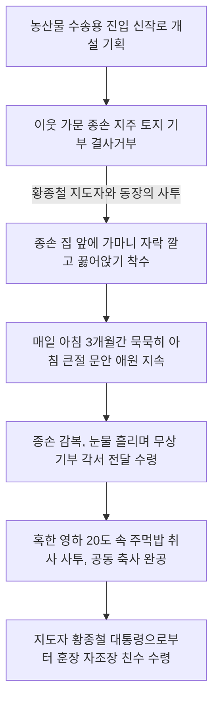

# 충남 논산군 연무읍 동산1동 행정마을 — 가마니 자락의 3개월 아침 문안 굴복 신화, 훈장 지도자 황종철과 주먹밥 혹한 사투로 세운 자조 영농촌

---

## 1. 마을 개황 및 숯장이 피난 난민촌의 고단한 어제

### 가. 살구나무 아래 모여든 피난 전재민 부락
충청남도 논산군 연무읍 동산1동(행정마을)은 원래 조선 시대 말기 깊은 숲속에 아늑하게 파묻혀 있던 작은 양반촌이었습니다.

* **행정마을 이름의 유래**: 어느 양반집 넓은 마당 한가운데에 정자처럼 거대하게 솟아오른 고풍스러운 살구나무(杏)가 유명하다 하여 인근 이웃들로부터 '행정(杏亭)마을'이라 불리게 되었습니다.
* **숯장이들의 처절한 생계**: 당시 행정마을은 겨우 30여 호 남짓이었는데, 몇몇 부농을 제외하고는 주변 야산에서 온종일 나무를 베어다 가마에서 숯을 구워 판매하는 영세 숯장이들이 대다수였습니다.
* **1950년대 군부대 설치와 이주민의 유입**: 1950년대 한국전쟁 직후 인근에 거대한 대한민국 육군훈련소(연무대)가 들어서면서 행정구역이 연무읍 동산리로 명칭이 변경되었습니다. 이때 전국 각지에서 모여든 수많은 피난민(전재민)들이 정착하면서 가구 수가 70여 호로 급격히 불어났습니다.

### 나. 척박한 구릉지와 협소한 영농
지대 대부분이 농작물을 기르기 힘든 완만하고 건조한 붉은 흙의 구릉지 지형이었습니다. 가구당 평균 경지면적은 0.8ha로 전국 평균(1.0ha)을 한참 밑돌았고, 척박한 야산은 나무가 무차별 벌채되어 헐벗은 상태였습니다. 1960년대 초 **박로원(朴魯源)** 씨에 의해 이웃 은진 지방의 백도 복숭아 재배 기술이 조기 도입되면서 간신히 과수 생계의 돌파구를 열어가고 있었으나, 전반적인 생활 수준은 여전히 빈궁하기 짝이 없었습니다.

---

## 2. 가마니 자락을 깔고 누운 '3개월간의 아침 문안 굴복' (1972년)

1958년 군 복무를 마치고 정든 동산동으로 귀향한 청년 **황종철(黃鍾喆)**이 고향의 낙후성을 타개하기 위해 1970년 새마을지도자를 전격 자임했습니다. 그는 세대교체가 이루어지는 혹독한 난관 속에서도 **단 한 번의 교체 없이 무려 7년간 성실하게 활동하며** 동산1동의 기틀을 다졌습니다.

### 가. 종손 지주의 완강한 반대와 가마니 자락의 결사
새마을 안길 확장과 원활한 농산물 수송을 위해 신작로와 바로 연결되는 대규모 진입 안길 개설이 전격 기획되었습니다. 
* **종손 지주의 철옹성**: 그러나 진입로의 가장 노른자위 핵심 땅을 소유하고 있던 이웃 동네 거대 문중인 **금(김) 씨** 가문의 종손은 문중의 영토를 훼손할 수 없다며 묘소를 가로막고 거칠게 욕설을 퍼부으며 문전박대했습니다.

### 나. 3개월간의 가마니 아침 묵묵한 큰절
황종철 지도자와 동장은 일생일대의 결단을 내렸습니다. 
* **감동의 큰절 투쟁**: 두 사람은 다음 날 새벽부터 거친 **볏짚 가마니 자락**을 품에 안고 이웃 동네 종손 지주의 집 문 앞으로 찾아갔습니다. 그들은 차가운 흙바닥에 가마니 자락을 깔고 조용히 꿇어앉아, 아침 해가 뜰 때까지 문안 큰절을 드렸습니다.
* **3개월간의 묵묵한 침묵**: 비가 오나 눈이 오나 매일 아침 단 하루도 빠징없이 **거의 3개월(90여 일)** 동안 문전에 가마니 자락을 깔고 엎드려 향토 복흥을 위해 한 평만 양보해 달라고 소리 없이 애원했습니다. 
* **마침내 열린 문**: 매일 아침 문을 열 때마다 가마니 자락 위에 엎드려 머리를 조아리는 두 청년의 초인적인 정성과 숭고한 충정에 크게 질겁하고 깊이 감동한 문중 종손은, 마침내 무릎을 꿇고 눈물을 흘리며 *"내 자식들도 내게 이렇게 극진하지 못했거늘, 나라와 마을을 살리려는 그대들의 위대한 고집에 내 기꺼이 땅을 무상 기부하겠소"*라며 토지 문서를 선뜻 건네주었습니다. 마침내 굽이치던 고갯길 산모퉁이가 곧게 트이며 동산1동의 시원한 현대식 진입 신작로가 준공되었습니다.

---

## 3. 동산1동 행정마을 역사적 주민총회 회의록 완벽 복원

살구나무 아래에서 가난한 숯장이들과 피난민들이 한겨울 혹한 속에서 얼어붙은 주먹밥을 삼키며, 농토를 양보하고 길을 열기까지 벌였던 주민총회를 원안 그대로 복원합니다.

### 📄 [회의록 1] 선가재 논길 신설을 위한 격돌 총회
* **일시**: 1972년 11월 10일 (19:30 ~ 21:30)
* **장소**: 마을회관 및 동정 천막
* **의제**: 농로 가설을 위한 부지 기증 및 농로 확장 노선 결정의 건
* **참석인원**: 동장 및 전진회 회장 외 주민 60여 명 참석
* **사회자**: 동장 (이재국)

* **회의 진행 및 대화 내용**:
  * **동장**: "주민 여러분, 바쁘신 가운데도 이렇게 뜻있는 분들과 함께 구수회의를 갖게 되어 감개무량합니다. 지난번 회의 결과대로, 우리가 내년에 전격적으로 시행해야 할 안길 농로 개설 구역을 몇몇 지주분들과 사전에 성심껏 협의했습니다. 다만 가장 큰 장벽은 이웃 마을 금 씨 문중 소유의 임야 140여 평인데, 이에 대해 좋은 대책이 있으시면 들려주십시오."
  * **이원재**: "좁아터진 동네 고삿길을 확장하거나 새로운 농로를 가설하는 데는 땅을 아낌없이 기부하는 희생이 뒤따를 수밖에 없소. 이 어려운 부지 조율 문제는 동장과 전진회 회장께서 직접 나서서 밤낮으로 지주들을 설득해 좋은 대책을 세워주기로 믿고 위임하고, 오늘 골치 아픈 회의는 이만 일찍 폐회합시다!"
  * **사회자 (동장)**: "어허, 이원재 씨! 이 중차대한 일을 그저 이장단에만 미뤄놓고 도망치듯 끝낼 수는 없습니다. 주민 여러분, 날씨가 이렇게 쌀쌀하고 찬 바람이 부는데도 많이 참석해 주셔서 참으로 무슨 일이든 우리 동민이 뭉치기만 하면 100% 다 이루어낼 수 있을 것 같습니다. 먼저 본 안건에 본격적으로 들어가기 전에 몇 가지 유의사항을 일러두겠습니다."
  * **김영선**: "(손을 비비며 짜증스럽게) 대체 무슨 해괴한 회의를 하려고 사람을 이 혹한의 밤바람 속에 이렇게 붙잡아 두는 거요? 날씨가 무척 추운데 빨리 결정하고 끝냅시다!"
  * **사회자 (동장)**: "예, 미안합니다. 오늘 회의 소집의 핵심은 다름이 아니라 길 때문입니다. 현재 우리 마을을 가로지르는 리어카 길이 있기는 합니다만, 아시다시피 너무 구불구불하고 좁아서 경운기도 왕래하지 못합니다. 그리하여 앞산을 통째로 깎아 가르고, 선가재(仙家齋) 논자리가 있는 곳으로 길을 곧고 넓게 새로 내야만 향후 복숭아 수송 기계화가 수월해지기에 그 부지 승낙을 의결하고자 합니다."
  * **이재국**: "(버럭 소리를 지르며 가로막는다) 이봐요, 지도자님! 나는 현재 있는 길도 차고 넘치게 너무 넓다고 봅니다! 옛날 우리 조상대대로 아주 좁아터진 오솔길에서도 잘만 살았소! 길이 좁아서 물건을 못 실어 다닌 것이 아니라, 당장 팔아먹을 수확 물건 자체가 없어서 못 다닌 것이란 말이오! 그러니 남의 집 옥토 같은 쌀 논밭을 길바닥으로 편입시킨답시고 아까운 선가재 땅에 괭이질을 절대 하지 마시오!"
  * **지도자 (황종철)**: "이재국 어르신, 노여움을 누르십시오. 옛날에는 물건이 없어 좁은 길도 다녔다지만, 지금은 세상이 변해 보란 듯이 백도 복숭아를 경운기에 가득 실어 읍내 오산 장터나 은진 장터로 내다 팔아야 우리 자식들을 대학 공부시키고 부자가 될 수 있습니다. 좁은 고삿길에 갇혀 평생 가난한 숯장이로 늙을 수는 없지 않습니까? 땅이 깎여나가는 아픔을 겪는 지주분들께는 우리 동네가 훗날 영농 수익금으로 충분한 대토를 보전해 드릴 테니, 고향의 천지개벽을 위해 한 번만 너그럽게 마당과 논둑을 허물어 주시길 애절하게 간곡히 호소합니다!"
  * **이재국**: "그렇다면 내일 아침에 땅 지주들의 정식 날인을 받고 공사를 밀어붙입시다."
  * **지도자 (황종철)**: "참말로 몹시 추운 겨울 날씨입니다. 그럼에도 불구하고 이 외진 천막 사랑방 자리에 늦게까지 참석해 주신 주민 여러분께 진심으로 감사를 드리며, 오늘 회의는 농가 개량과 앞산 도로 개설을 12월 1일부터 전격 추진하는 것으로 힘차게 통과 의결시키고 폐회하겠습니다. 편안히 돌아가십시오!"

---

## 4. 영하 20도 혹한 속 '입김 주먹밥'과 공동 축사의 피땀 사투

황 지도자는 주민들의 단합을 소득으로 직결시키기 위해 대규모 공동 자금 조성을 목표로 공동 도급 공사를 추진했습니다.

* **살인적 한파 속의 사투**: 1974년 한겨울 영하 20도를 밑도는 살인적인 최전방 혹한기, 주민들은 강풍이 불어 닥쳐 펄럭이는 가마니 천막 하나에 의지하여 언 땅을 곡괭이로 파내며 토목 공사를 강행했습니다.
* **눈물의 주먹밥**: 살을 에는 한파 탓에 공수해 온 새마을 밥은 순식간에 돌덩이처럼 단단하게 얼어붙었습니다. 주민들은 **차가운 주먹밥을 뜨거운 입김으로 호호 불어 녹여가며** 허기를 채웠고, 얼어터진 손가락을 부여잡고 밤샘 노동을 이어나갔습니다.
* **경이로운 흑자 달성**: 이 지옥 같은 겨울철 혹한 투쟁을 통해 동산1동 주민들은 외지 업자 하청 없이 스스로 대공사를 전격 시공 완료해 내는 쾌거를 거두었습니다. 그 결과 **순수 공사 이익금 1,804,505원 전액을 고스란히 마을 공동 발전 기금으로 수급 적립**시켰고, 주민 노임 소득으로만 무려 **2,350,090원**의 풍성한 겨울철 배당 소득을 환수하여 가난의 고리를 완전히 끊어냈습니다.

---

## 5. 자조 영농 도약 및 훈장 서훈 성과 (1976년)

동산1동 행정마을은 황종철 지도자의 1인 3역(설계, 현장감독, 자금조달) 활약 아래, 1970년대 중반 대한민국 최고의 과수 가축 특화 부촌으로 정착되었습니다.

* **최우수 자립마을 조기 도약**: 1972년 충남 관내에서 최초로 정부 공식 **'자립마을'** 승급에 성공했습니다.
* **영예의 새마을훈장 자조장 수훈**: 이러한 불멸의 공로로 **1976년 12월 10일, 전국 새마을지도자대회에서 황종철 지도자가 박정희 대통령 각하로부터 직접 영예로운 새마을훈장 자조장**을 가슴에 친수 수훈받는 필생의 영광을 거두었습니다.

### 🏢 동산1동 행정마을 현대화 보유 자산 및 영농 실적

| 구분 | 주요 개발 성과 내역 | 무상 기부 토지 미담 내역 |
| :--- | :--- | :--- |
| **복지 인프라** | • 전 가구 고유 체신 전화 완비 • 마을 복지회관 및 어린이 공동 탁아소 가설 완료 • 전 가구 수세식 정화조 현대화 완료 | • **황종철 지도자**: 개인 소유 답 110평 기증 • **박로원 씨**: 백도 복숭아 묘목 및 기술 무상 교육 수여 • **이웃 금(김) 씨 종손**: 진입로 요지 150평 기부 |
| **기계화 정비** | • 경운기 18대 • 동력분무기 45대 • 탈곡기 32대 보유 | • **공동 공사 이익 기금**: 1,804,505원 적립 완료 |

> [!IMPORTANT]
> 숯 가마 터에서 절망적인 하루를 보내던 피난 이주 난민촌 동산1동은, 황종철 지도자가 가마니 자락 위에 엎드려 바친 **3개월간의 목숨 건 아침 큰절**과 영하 20도 속에서 **얼어붙은 주먹밥을 입김으로 녹여 먹은 주민들의 초인적인 사투**를 통해, 마침내 대통령이 훈장을 직접 수여하는 최고의 현대화 무결점 시범 복지촌으로 우뚝 섰습니다.

---
*(출처: 영광의 발자취 - 마을 단위 새마을운동 추진사 제1집)*
