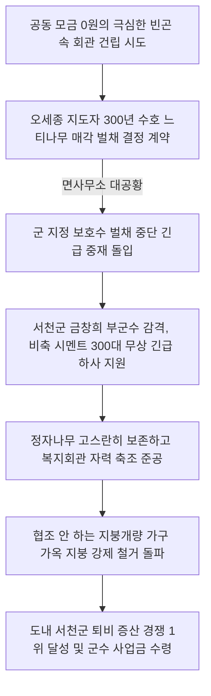

# 충남 서천군 판교면 복대2리 — 300년 정자나무 매각 결사 소동과 시멘트 300포 하사, 게으른 낙오촌에서 도내 퇴비 1위로 우뚝 선 기적

---

## 1. 마을 개황 및 씨족 갈등으로 점철된 서천의 낙오촌

### 가. 복잡한 다성씨족 부락과 침체의 세월
충청남도 서천군 판교면 복대2리(복대리 2구)는 풍천 임씨(豊川 任氏, 원문 오타 '풍천금씨'), 전주 이씨, 수원 백씨, 해주 오씨, 고령 전씨, 장흥 임씨 등 수많은 외지 성씨들이 무질서하게 섞여 정착해 살아가던 다성(多姓) 부락이었습니다.

* **뿌리 깊은 갈등과 질시**: 한 문중이 이끌어가는 집성촌과 달리, 각 문중 간의 주도권 다툼과 씨족 간의 이기적인 불신, 질시가 지독히 심각했습니다. 주민들은 사소한 공동 사업 계획만 발표되어도 수군거리며 반대 파벌을 형성하기 바빴고, 동네 주막에서 밤낮 사나운 욕설과 싸움을 일삼기 일쑤였습니다.
* **정부의 블랙리스트, '못된 마을' 낙인**: 1970년부터 1973년까지 새마을운동의 뜨거운 불길이 전국에 당겨졌으나, 복대2구 주민들은 단 한 개의 사업도 시도하지 않고 3년 동안 차갑게 외면했습니다. 판교면사무소에서는 복대2구를 **"새마을 지도도 아예 통하지 않는 아주 게으르고 못된 낙오마을"**로 분류해 행정 지원 목록에서 완전히 제쳐두고 있었습니다. 가구당 연평균 소득은 20만 원 이하의 영세 산골이었습니다.

---

## 2. 300년 보호 느티나무 매각 소동과 300대 비축 시멘트 하사 기적 (1974년)

주민들은 더 이상 이웃 부락들의 비웃음을 살 수 없다고 뼈저리게 각성했습니다. 1972년 4월, 마을의 깨어있는 젊은 청년 **김병열(金柄烈, 31)**을 이장으로 과감히 옹립했고, 이어 1974년 2월 17일 마을 총회에서 불도저 같은 강단과 지혜를 갖춘 **오세종(吳世宗)**을 새마을지도자 겸 이장으로 전격 선출하며 혁신의 첫 삽을 떴습니다.

### 가. "300년 묵은 수호신 정자나무를 팔아 치우겠다!"
* **맨주먹의 도전**: 오세종 지도자는 공동체 의식을 다지기 위해 주민들이 다 함께 모일 다목적 새마을회관 건립을 선언했습니다. 그러나 다성씨족 간의 오랜 알력으로 단 한 푼의 공동 건립 모금도 이루어지지 않는 맨주먹 상태였습니다.
* **수호 느티나무 매각 결사**: 오 지도자는 마을 개발 위원들과 긴밀히 구수회의를 거친 후, 충격적인 해결책을 전격 발표했습니다. *"돈이 없다면 마을 복판에 수백 년 대대로 서 있는 **300년 묵은 거대한 느티나무(정자나무)를 벌채해서 목재 업자에게 통째로 팔아 건립 기금**을 마련하자!"*라며 매각 결약서에 전격 도장을 찍었습니다.

### 나. 면사무소의 발칵 뒤집힌 경악과 부군수의 시멘트 300포 지원
* **보호수 벌채 소동**: 이 전대미문의 소식이 전해지자, 판교면사무소는 비상이 걸렸습니다. *"그 나무는 마을의 역사이자 함부로 벨 수 없는 군 지정 보호수인데, 복대리 놈들이 새마을을 한답시고 정말 도끼를 들고 나무를 자르려 한다!"*라며 면장과 직원들이 사색이 되어 현장으로 뛰어왔습니다.
* **금창희 부군수의 감동적인 하사**: 이 뜨겁고 과감한 느티나무 벌채 소동은 서천군청 **금창희(琴昌熙) 부군수**의 귀에 전격 보고되었습니다. 부군수는 마을을 위해 수호신 정자나무까지 베어내겠다는 가난한 복대2구 주민들의 엄청난 결사와 독한 마음에 깊은 감동을 받았습니다. *"그 거룩하고 소중한 정자나무를 벨 필요가 없도록, 군에서 숨겨둔 비축 긴급 양회(시멘트) 300포대를 복대2구에 즉시 무상 공급해 주겠다"*라며 긴급 수송 트럭을 보내주었습니다. 온 동민들은 시멘트 트럭 앞에서 기뻐 어쩔 줄을 몰라 춤을 추었고, 300년 느티나무를 고스란히 보존한 채 초현대식 마을 복지회관을 자력으로 우뚝 세워 올렸습니다.

---

## 3. "안 하면 그냥 뜯어낸다!" — 거부 가옥 지붕 강제 철거 돌파구 (1975년)

* **완고한 지붕개량 반대파**: 1975년 초, 복대2구는 정부로부터 29동 분량의 슬레이트 지붕 개량 자금을 확보했습니다. 그러나 다성씨족 간의 파벌 갈등에 빠진 몇몇 고집 센 주민들이 *"새마을이 밥 먹여 주느냐, 내 집 지붕을 내 마음대로 놔두라"*라며 거칠게 협조를 거부했습니다.
* **지도자들의 솔선수범과 지붕 강제 철거**: 오세종 지도자와 개발위원들은 일일이 말싸움하는 대신 몸으로 돌파했습니다. 먼저 오 지도자와 개발위원들의 집 지붕을 완벽하게 현대식으로 뜯어고쳐 솔선수범을 보여주었습니다. 그런 뒤, 지붕 개량을 결사반대하던 주민들의 집으로 동민 장정들과 사다리를 메고 전격 몰려갔습니다. 그들은 **반대 지주가 욕설을 퍼붓는 가운데 아무 말 없이 지붕 위로 기어 올라가 썩어가는 초가 이엉을 사정없이 걷어내기 시작**했습니다. 지붕이 통째로 뜯겨나가 하늘이 훤히 드러나자, 반대하던 주민들도 어쩔 수 없이 지붕 개량에 합류했고, 복대2구는 단 며칠 만에 쓰러져가던 29동의 초가를 은빛 슬레이트 명품 주택 단지로 100% 현대화 개량하는 전무후무한 돌파력을 증명했습니다.

---

## 4. 피와 땀의 퇴비 증산 서천군 1위 대역전극 (1976년)

과거 "가장 게으른 낙오 부락"으로 천대받던 복대2구 주민들은 향토의 자존심을 걸고, 농가의 기틀이 되는 **'가을철 퇴비 증산 경쟁 사업'**에 사생결단으로 착수했습니다.

* **서천군 최고의 퇴비 부락**: 온 동민들이 매일 새벽 주막 술판을 벌이던 손으로 지게를 지고 산비탈 구릉지로 올라가 잡풀과 수풀을 베어 날랐습니다. 피와 땀으로 얼룩진 퇴비 생산 실적은 **서천군 전체에서 당당히 1위**를 차지하는 영광의 대역전극을 이룩했습니다.
* **대단위 상금 확보**: 이 위대한 도약으로 **시상금 30만 원**을 획득했고, 감격한 **정연달(鄭淵達) 서천군수**가 직접 복대2구를 격려 방문해 *"과거의 낙오촌이 군내 1위가 되었다"*라며 격찬을 쏟아내고, **군수 특별 사업비 50만 원**을 지갑에서 선뜻 꺼내 하사해 주어 주민들은 부둥켜안고 울음바다를 이루었습니다.

### 🏢 서천 복대2구 연도별 새마을 종합 구축 실적

| 연도 | 주요 개발 사업 내역 | 총공사 비용 (원) | 실질적 복지 편의 성과 |
| :--- | :--- | :---: | :--- |
| **1974년** | • 300년 느티나무 보존하며 다목적 회관 건립 • 진입로 확장 및 석축 쌓기 (200m) | **1,500,000** | 보호수 보존 및 대단위 다목적 복지 공간 준공 |
| **1975년** | • 거부 농가 강제 집행 불량 가옥 개량 (29동) • 측백 및 사철나무 생울타리 조경 사업 | **5,410,000** | 썩은 초가 제거 위생 은빛 슬레이트촌 달성 |
| **1976년** | • 농업 기계화 농로 개설 완료 (500m) • 퇴비 증산 및 가을철 공동 수확 | **3,280,000** | **서천군 전체 퇴비 증산 1위 달성 및 군수 하사** |

> [!IMPORTANT]
> 3년 동안 새마을을 거부하여 '못된 게으른 마을'로 손가락질 받던 서천 복대2구는, **300년 수호 느티나무를 팔겠다는 오세종 지도자의 목숨 건 배수진**과 반대파의 집 지붕을 묵묵히 기어 올라가 철거해 버린 **불도저 같은 자조 협동의 투지**를 통해, 마침내 도내 퇴비 최우수 1위 부락으로 찬란하게 우뚝 섰습니다.

---
*(출처: 영광의 발자취 - 마을 단위 새마을운동 추진사 제1집)*
